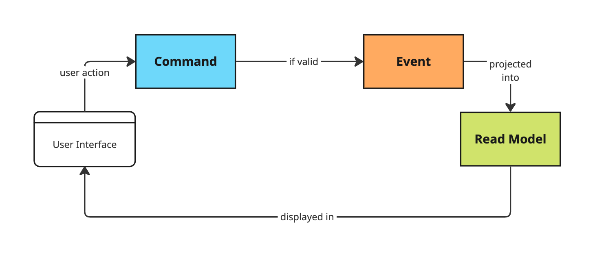
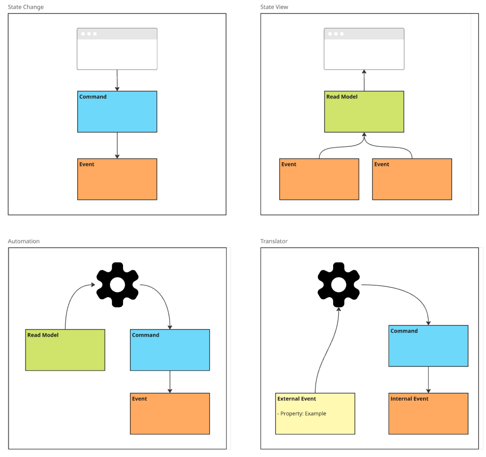
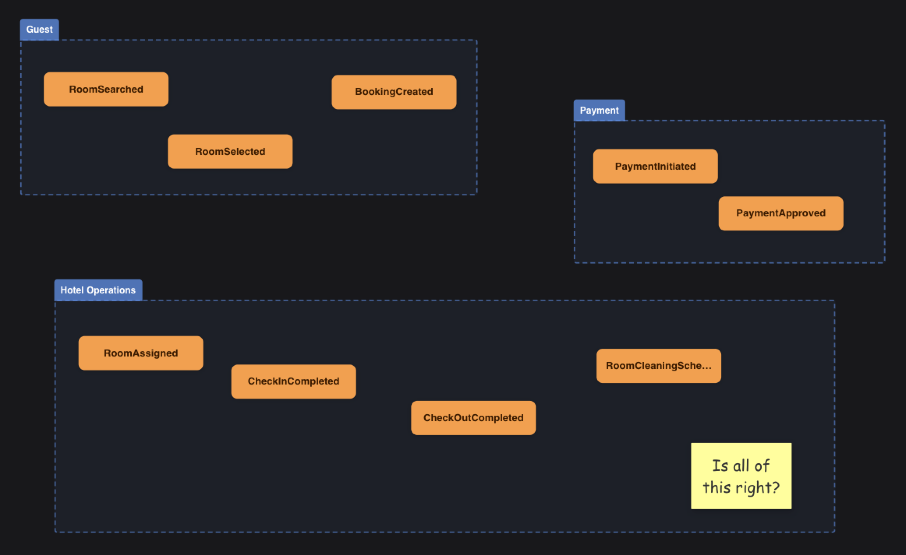
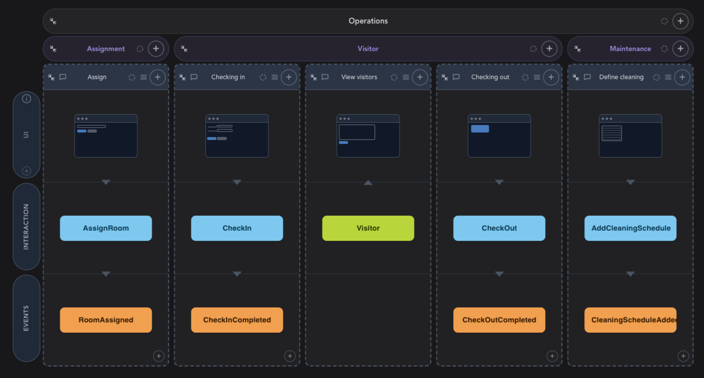
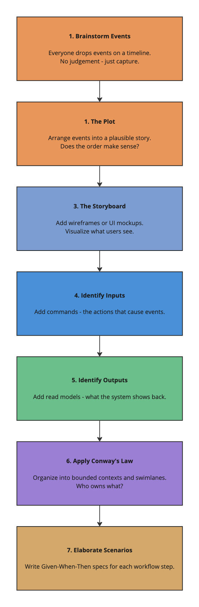

# Stop guessing. Start modeling.

Most software projects don't fail because of bad code. They fail because the team built the wrong thing. Or built the right thing — but nobody agrees on what it actually does.

I've seen it over and over. A product owner, a developer, and a domain expert sit in a meeting. They all walk out believing they understood each other. Three weeks later, when the code shows up, reality proves otherwise. That's expensive. And it's avoidable.

That's where [Event Modeling](https://eventmodeling.org) comes in.

---

## What is Event Modeling?

Event Modeling is a way to design and describe information systems using a shared timeline. It was developed by [Adam Dymitruk](https://www.linkedin.com/in/eventmodeling/) at Adaptech Group, and it's built on a simple but powerful idea: instead of describing what your system *is*, you describe what it *does* — as a story that unfolds over time.

You can think of it as a blueprint for your entire system. But unlike a traditional specification document that nobody reads, an event model is visual, collaborative, and alive. Everyone on the team — developers, domain experts, product owners, designers — can look at it and understand what's going on.

The best part? It only uses **3 building blocks** and **4 patterns**. You can explain the core concept in minutes. The rest you learn by doing.

---

## The Three Building Blocks

The whole model revolves around three concepts:

**Events** are facts. Things that happened. `RoomBooked`, `PaymentProcessed`, `OrderShipped`. These are immutable state changes stored on a timeline — the backbone of the model.

**Commands** are intentions. The thing a user (or system) is trying to do that will *cause* an event. `BookRoom`, `ProcessPayment`, `ShipOrder`. They represent the inputs.

**Read Models** (or Views) are the outputs — how the system informs the user about what's going on. The available room calendar. The order status page. The shipping dashboard.

Put them together and you've got a complete picture of any workflow:

That's it. Command comes in, event gets recorded, read model gets updated. Every workflow in your system follows this same loop.

---

## The Four Patterns

Three building blocks. Four ways to combine them. That's the whole vocabulary.

**State Change** is the most common pattern — a user submits a command, it gets validated, and an event is recorded. `CheckIn` happens, `CheckinCompleted` is stored. The intent is explicit, the outcome is captured.

**State View** is the read side — events are projected into a read model that the UI displays. The `Visitor` read model gets built from `RoomAssigned` and `CheckinCompleted` events. It's always up to date, and you can rebuild it from scratch at any point just by replaying the events.

**Automation** is what happens behind the scenes — a processor watches a read model (think: a to-do list), picks up items, and fires a command to handle each one. Sending a confirmation email after check-in. Triggering a payment. Scheduling a cleaning slot. No human involved, same building blocks.

**Translator** handles integration — when an external system feeds your system events you don't own, you translate them into your own language. You don't want GPS coordinates as domain events. You want `GuestLeftHotel` and `GuestReturnedToRoom` — events that mean something in your context.

That's it. Any workflow in any system, no matter how complex, is some combination of those four patterns. Once you recognise them, you'll see them everywhere.

---

## It starts with a brainstorm

Before you get to a clean model, you start messy. And that's the point.

The first step of an Event Modeling session is brainstorming — everyone in the room, regardless of role, dumps every event they can think of onto the canvas. No structure yet. No judgment. Just: "what happens in this system?" Developers think about state changes. Domain experts think about business processes. Product owners think about user journeys. All of it goes up.

Look at that — it's deliberately unpolished. Events scattered across swim lanes, people questioning whether they've got it right ("Is all of this right?"), duplicates, gaps. That's normal. The value isn't in the tidiness; it's in surfacing everything that different people in the room carry in their heads. Things that are obvious to the domain expert but completely invisible to the developer. Things the developer anticipated but the product owner hadn't thought through.

This is where alignment actually happens. Not in a requirements document written in isolation, but in the room, together, with everyone pointing at the same canvas.

Once the events are out in the open, you start arranging them. You put them in a plausible order. You ask: does this story make sense? Can we walk through it from start to finish? That process reveals the gaps — missing events, ambiguous naming, assumptions that only one person in the room was carrying.

From that refined timeline, the full event model takes shape.

---

## A concrete example

Here's a real event model — a visitor and room operations system built from exactly that kind of brainstorm:

Reading it left to right, the system tells a story through five workflow slices:

Each vertical slice is independent. `AssignRoom` fires and `RoomAssigned` is recorded. `CheckIn` fires and `CheckinCompleted` is recorded. The `Visitor` read model is then *projected* from those events — it doesn't care how the data got there, it just reads the event stream and builds a view the front end can display.

Notice what this means in practice. A developer picking up the "Check In" slice knows exactly what they're building: handle the `CheckIn` command, validate it, record a `CheckinCompleted` event. Done. They don't need to understand the whole system. A product owner looking at the same model can ask: "What information do we need to show on the Visitor list?" — and point straight at the `Visitor` read model to have that conversation. An operations manager can trace what triggers a cleaning schedule without reading a single line of code.

That's the point. Everyone is looking at the same thing, and everyone understands it.

---

## It's not just for developers

This is what makes Event Modeling different from most technical design approaches. It's built for everyone in the room.

Traditional methods — UML diagrams, entity-relationship models, architecture docs — tend to be written *by* developers *for* developers. Domain experts tune out. Product owners nod politely and go back to Confluence. The gap between business intent and technical implementation grows wider.

Event Modeling flips this. The language of the model is the language of the business. You're not talking about tables, classes, or API endpoints. You're talking about what happened, who did it, and what it made possible.

That shared language is genuinely valuable. I wrote about this in my article on [Total Cost of Ownership](https://novanet.no/total-cost-of-ownership-software/) — the root cause of most expensive software problems is misalignment. Event Modeling is one of the most effective tools I've seen for addressing that directly.

---

## The workshop: 7 steps to a complete blueprint

An Event Modeling session isn't a long waterfall exercise. The typical format is a focused workshop — often a day or two — where the whole team participates. You go through 7 steps:

By the end, you have a blueprint that covers *every field, every state change, every integration*. You can trace any piece of data from the moment a user types it into a form, through every event it triggers, all the way to where it ends up on a screen somewhere else. That rigour is what makes the model so useful.

---

## The flat cost curve

Here's something that should matter to anyone making investment decisions in software.

The biggest hidden cost in traditional development is rework. Every new feature you add has a chance of touching existing code. The further along a project is, the more expensive that becomes — because there's more existing work to understand, to risk breaking, to re-test.

Event Modeling changes this. Because each workflow step is defined by its contract — the shape of the command going in and the event coming out — you can build them in relative isolation. Done right, the cost of each new workflow step stays roughly constant, regardless of how much has already been built.

That's not a trivial statement. It means estimates become reliable. Priorities can shift without blowing the budget. Fixed-price engagements become realistic. You go from "it depends" to "here's what that costs".

---

## The relationship to Event Sourcing

Event Modeling and Event Sourcing are not the same thing — but they're natural companions.

Event Modeling is a *design* technique. It works for any system, including traditional CRUD-style architectures. You don't need event sourcing to use it.

That said, if your system is built on event sourcing — where the events themselves are the source of truth — then the model and the implementation speak the same language from day one. The `CheckinCompleted` event in your model *is* the event your code produces and stores. No translation layer. No impedance mismatch.

If you want to understand event sourcing more, I'd recommend [Martin Dilger's book](https://leanpub.com/eventmodeling-and-eventsourcing) — he covers both techniques and how they reinforce each other. I wrote separately about [event sourcing and why it matters](https://novanet.no/stop-losing-information-event-sourcing/) — the short version: stop throwing information away.

---

## Tools that make it practical

You can absolutely do Event Modeling with sticky notes on a wall or on a shared whiteboard tool. For remote teams and more complex systems, dedicated tooling helps.

We're building [Cratis Studio](https://cratis.studio) specifically for this. It supports the full Event Modeling workflow — brainstorming, layout, team collaboration in real time, read model projections, and code generation for C# commands, events, and projections. The goal is to keep the model and the codebase in sync, rather than having the model become a historical artefact on a Confluence page nobody visits.

It's built on top of [Cratis Chronicle](https://cratis.io), an open-source event sourcing platform for .NET — so if you're going all in on the event sourcing side as well, the stack is coherent from design to deployment.

---

## When should you consider this?

Honestly? I'd argue for any system where multiple people need to understand how it works. That covers a lot of ground.

Concretely, it's most valuable when:

- You're building something non-trivial with meaningful business processes
- You have domain experts who need to stay involved
- You want to reduce the cost of getting requirements wrong
- You're working with distributed teams where alignment is harder
- You need traceability and auditability built in from the start

If you're building a static brochure site, probably unnecessary. But if you're building something critical to how a business operates? Start here.

---

## Final thoughts

Software is a collaborative effort. The best systems I've worked on were ones where the whole team — not just the developers — understood what was being built and why. Event Modeling is the best tool I've found for making that happen in a practical, structured way.

It's not magic. It takes facilitation, discipline, and a willingness to be explicit about things teams often leave implicit. But once you've done a session and watched a product owner and a developer finish each other's sentences using the same vocabulary — you'll wonder how you worked any other way.

[Reach out to us at Novanet](https://novanet.no/kontakt/) if you'd like to explore how Event Modeling could work in your context. We run workshops, and we're happy to help you get started.
