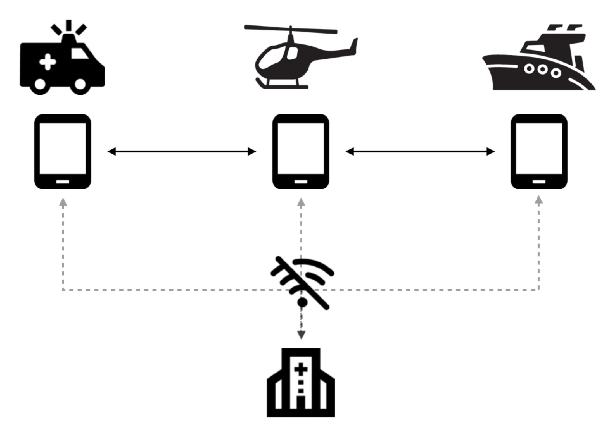
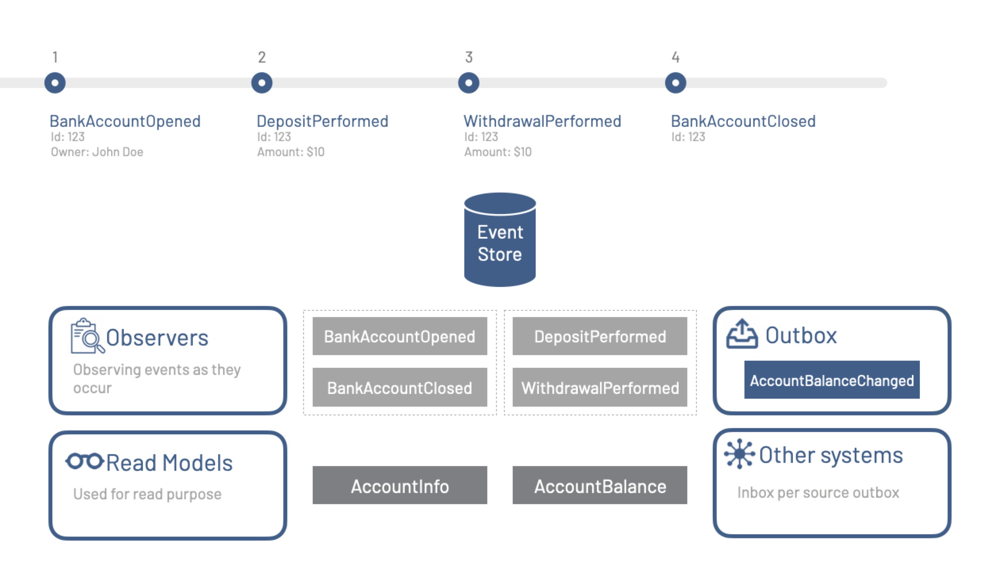
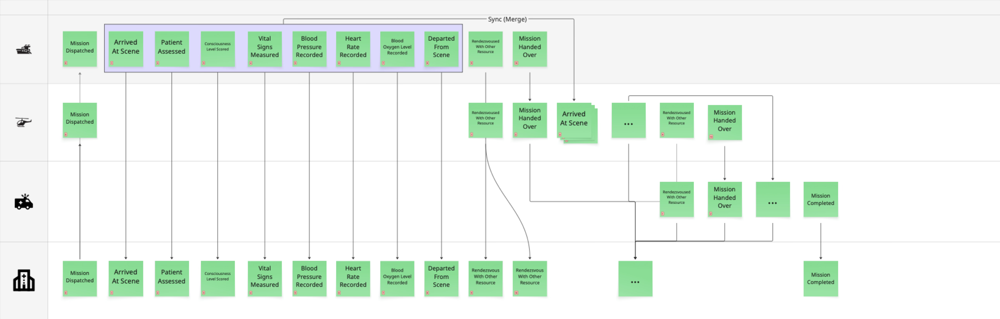

# Fra papirskjema til alle plattformer – EWA tar akuttjenesten inn i fremtiden

## Oppgaven

Novanet ble engasjert av [Bliksund](https://bliksund.com) for å hjelpe teamet med å skrive om klienten til EWA – Emergency Worker Assistant – fra bunnen av. Produktet eksisterte allerede, men var låst til Windows og kunne verken porteres eller videreutvikles til å nå de plattformene markedet etterspurte. Målet var klart: én felles kodebase som kjøre nativt på iOS, iPadOS, Android, Windows og i nettleseren – og den måtte være klar for kundeakseptansetesting i januar 2026. Prosjektet startet i august 2025.

## Bakgrunn

EWA er Bliksunds digitalisering av de manuelle arbeidsflytene som tradisjonelt har preget akuttmedisinsk personell i felten. I stedet for papirskjemaer som forflyttes mellom enheter og avdelinger kan ambulansepersonell, helikoptermannskap og koordinatorer ved sykehuset jobbe med én og samme pasientjournal – i sanntid, uavhengig av hvilken enhet de holder i hendene. Det er ikke snakk om en triviell dataregistreringsapplikasjon. I akuttmedisinen er presisjon og kontinuitet bokstavelig talt et spørsmål om liv og død.

Tenk deg et oppdrag der et redningshelikopter plukker opp en pasient i fjellet. Underveis registrerer mannskapet vitale målinger, medisineringer og vurderinger direkte i EWA. Når pasienten overføres til en bilambulanse halvveis ned til sykehuset, skal mottakende mannskap umiddelbart se alt det foregående mannskapet har registrert – uten forsinkelse, uten manuell overlevering av papirer og uten risiko for at informasjon faller bort i overgangen. Sykehuset på sin side følger situasjonen fortløpende og kan forberede mottak lenge før ambulansen ankommer. Dette er hva EWA legger til rette for.

## Utfordringen

Den eksisterende klienten var skrevet for Windows og lot seg ikke gjenbruke på tvers av plattformer. Kodebasen var ikke designet med portabilitet i tankene, og forsøk på å tilpasse den ville ha vært mer tidkrevende og risikofylt enn å starte på nytt. Beslutningen om å skrive om klienten fra scratch var derfor både riktig og nødvendig.

Men prosjektet hadde svært krevende rammer. Teamet var lite: den eksisterende Bliksund-teamet var allerede fullt opptatt med vedlikehold og support av den eksisterende løsningen, og kun én person fra det teamet kunne bidra – og det mellom 50 og 75 prosent av tiden. I tillegg besto prosjektteamet av en nederlandsk konsulent med god teknisk kompetanse, og Einar Ingebrigtsen fra Novanet som bidro med 50 prosent av sin tid. Mot slutten av prosjektet, i november og desember, kom et nytt teammedlem fra Bliksund inn, men på det tidspunktet var mesteparten av grunnarbeidet allerede lagt.

Og tidsrammen? Knappe fem måneder fra kickoff til kundeakseptansetesting.

Det var heller ikke fritt frem teknologisk. Valg av teknologi måtte i rimelig grad samsvare med den kompetansen som allerede fantes i Bliksund-teamet, primært C# og .NET. Man kunne ikke hente inn en hel ny stack som ingen hadde erfaring med – ikke med den tidsplanen som lå der. Og til slutt: løsningen måtte fungere like godt for kunder med egne, lokale serverinstallasjoner som for dem som kjører i skyen. On-premise-støtte var ikke et opsjonalt krav, men en absolutt forutsetning.

## Prosessen

En av de første og viktigste diskusjonene handlet om hva som egentlig er det vanskeligste i et system som EWA. Det er ikke brukergrensesnittet. Det er ikke skjemaene. Det vanskeligste er dataene – og spesifikt: hvordan sikre at alle parter til enhver tid har samme bilde av virkeligheten, selv i et miljø der nettverksforbindelsen kan forsvinne midt i et oppdrag.

I akuttjenesten er nettverkstilgang et privilegium, ikke en garanti. Ambulanser kjører gjennom tunneler og fjellpass. Helikoptre flyr over havstrekninger uten dekning. Sykehus har steder der mobilsignalet er svakt. En løsning som stopper å fungere uten internett, er ikke en løsning i dette domenet – det er en risiko. Vi valgte derfor tidlig å bygge systemet med et **offline-first**-prinsipp som absolutt kjerneantagelse: applikasjonen skal fungere fullt ut uten nettverkstilgang, og synkronisering er noe som skjer opportunistisk i bakgrunnen når forbindelsen er tilgjengelig.

Dette lyder enkelt, men innebærer krevende avveininger. Hva skjer når to enheter har gjort endringer på den samme pasienten mens begge var offline, og begge kobler seg på nett igjen? Hvem "vinner"? Svaret er at ingen vinner og ingen taper – begge har rett, fordi begge registrerte faktiske handlinger i sine respektive kontekster. Løsningen er ikke å overstyre den ene med den andre, men å representere begge som fakta og la systemet bygge et komplett bilde.

Illustrasjonen nedenfor viser samspillet mellom alle ressurser i løsningen – fra enheter i felten til backend på server – og hvordan synkronisering og offline-kapabilitet er vevd inn i hele arkitekturen.

## Hendelsesdrevet arkitektur og valget om å tenke i hendelser

Det var i møtet mellom kravene til revisjonsspor og synkronisering at de arkitektoniske valgene begynte å krystallisere seg. Et fullstendig revisjonsspor er ikke et "nice-to-have" i akuttmedisin – det er et krav med rettslige implikasjoner. Hva ble gjort, av hvem, på hvilket tidspunkt, i hvilken rekkefølge? Disse spørsmålene må ha entydige svar.

Et system som bare holder styr på gjeldende tilstand – "pasienten er nå i dette stadiet" – kan ikke svare på "hva skjedde mellom steg A og steg B". Tilstanden er en snømelding av historikken. Mye informasjon forsvinner i oversettelsen. Løsningen er å ikke kaste den informasjonen i utgangspunktet: i stedet for å lagre tilstand lagrer man hendelsene som medfører tilstand.

Dette er essensen i [Event Sourcing](https://novanet.no/stop-losing-information-event-sourcing/). I stedet for en database som til enhver tid speilbilde det nåværende, har du en uforanderlig, kronologisk sekvens av hendelser – "pasientvurdering registrert", "medisinering gitt", "overlevering til ny enhet gjennomført" – og tilstanden du se i brukergrensesnittet er alltid et resultat av å projisere disse hendelsene fremover i tid. Hendelsene er kilden til sannhet. Tilstanden er et avledet view.

Gevinsten for EWA er betydelig. Revisjonssporet er ikke et eget lag man må vedlikeholde – det *er* arkitekturen. Synkronisering mellom enheter handler ikke lenger om å avgjøre hvilken tilstand som er korrekt, men om å slå sammen hendelsesstrømmer som representerer ekte handlinger i den virkelige verden. Og ved debugging eller analyse kan man i prinsippet spole tilbake til et hvilket som helst tidspunkt og se nøyaktig hva systemet visste på det aktuelle tidspunktet.

Vi gikk ikke for fullstendig Event Sourcing i klassisk forstand – det ville ha introdusert kompleksitet som ikke stod i forhold til prosjektets tidsramme og teamstørrelse. I stedet valgte vi en hybrid tilnærming: alle endringer skrives som hendelser, men vi projiserer øyeblikkelig til en konkret tilstand som brukes til visning og beslutningsstøtte. Det gir oss fordelene ved hendelsesdrevet design – revisjonsspor, synkroniseringssikkerhet, domeneinnsikt – uten at vi trenger å bygge full Event Sourcing-infrastruktur med komplekse event-stores og flersifrede projeksjonsrørledninger overalt.

Illustrasjonen nedenfor viser eksempler de konkrete hendelsene som ble modellert i løsningen. Hendelsesmodellen er selve ryggraden i systemet, og arbeidet med å definere disse hendelsene var en av de mest verdifulle designøvelsene i prosjektet – det tvang teamet til å tenke presist om hva som faktisk *skjer* i en akuttsituasjon.

## Den tekniske arkitekturen

Med kravene og prinsippene klare begynte de konkrete teknologivalgene å gi seg selv.

For frontenden landet vi på React Native. Det var ikke et selvsagt valg – React Native bærer et rykte for å være kompromisset som verken gir ekte native-ytelse eller fullstendig webfleksibilitet. Men i EWAs tilfelle var argumentene overbevisende. React Native gir oss én JavaScript/TypeScript-kodebase som kompilerer til native kode på iOS, iPadOS, Android og Windows, og som kan kjøres i nettleseren via React Native for Web. Alternativet – å skrive og vedlikeholde separate native-applikasjoner for hvert platform – var ikke realistisk med et team på tre til fire personer og fem måneder til rådighet. React Native ga oss den nødvendige bredden uten å ofre den nødvendige dybden.

For backenden var valget enklere: C# og .NET. Teamet kjente teknologistacken, noe som reduserte risikoen betraktelig. Med en stram tidsplan er det siste man trenger å bruke tid på å lære seg et nytt rammeverk fra bunnen av. .NET er dessuten et modent og robust fundament for server-side logikk, og kombinert med Entity Framework Core gir det oss en produktiv sti til databaseoperasjoner.

Databasesituasjonen var flerlaget. På enhetene bruker vi SQLite – en liten, raskt, serverløs database som fungerer like bra på en iPad i et helikopter som på en Windows-laptop i en ambulanse. På server-siden, for on-premise-installasjoner, måtte vi støtte både MSSQL og PostgreSQL, ettersom kundene hadde ulike eksisterende infrastrukturer. Her kom [Cratis Arc](https://www.cratis.io/docs/Arc/index.html) inn som en nøkkelkomponent. Arc er et åpent kildekodesbibliotek for .NET som abstrahere bort databasespesifikke detaljer og gir en felles tilgang til ulike databasemotorer – inkludert migrasjoner, spørringer og konfiguration. Einar fra Novanet er blant de som vedlikeholder Arc, noe som ga teamet direkte tilgang til ekspertisen og muligheten til å gjøre presise tilpasninger der det trengtes.

For hendelseshåndteringen hentet vi byggeblokkene fra [Cratis Chronicle](https://www.cratis.io/docs/Chronicle/index.html). Chronicle er et rammeverk for Event Sourcing i .NET-miljøer, og ga oss fundamentet vi trengte for å håndtere hendelsesstrømmene på en strukturert og robust måte. Prosjektet krevde imidlertid en egenutviklet projeksjonsmotor som dynamisk projiserer hendelser til visningsvennlig tilstand på toppen av Entity Framework Core – en løsning som kombinerer fleksibiliteten til Chronicle med den kjente ORM-tilnærmingen teamet allerede behersket godt.

## Resultatet

EWA ble levert til kundeakseptansetesting i januar 2026 – på dato, som planlagt. Løsningen kjører på iOS, iPadOS, Android, Windows og i nettleseren fra én felles kodebase. Den fungerer fullt ut offline og synkroniserer automatisk når nettverket er tilgjengelig. Alle hendelser i systemet er sporbare, og pasientjournalen er konsistent på tvers av alle parter i et oppdrag – fra disponeringen på sykehuset til enheten i hendene på mannskapet ute i felten.

Det er verdt å understreke hva som ble oppnådd: et lite, delvis avsatt team gikk fra konsept til akseptansetestklart produkt på fem måneder. Det krever presise teknologivalg, en arkitektur som ikke sloss mot kravene, og et team som er villig til å ta prinsipielle beslutninger tidlig og holde seg til dem – selv når det er fristende å ta snarveier. Kombinasjonen av offline-first-tankegang, hendelsesdrevet arkitektur og gjenbruk av velprøvde biblioteker som Cratis Arc og Cratis Chronicle var det som gjorde det mulig.
