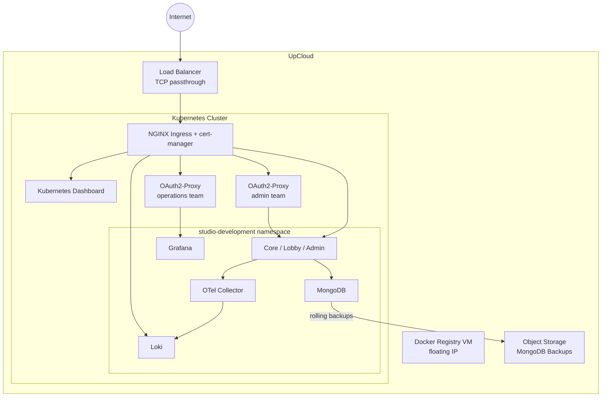
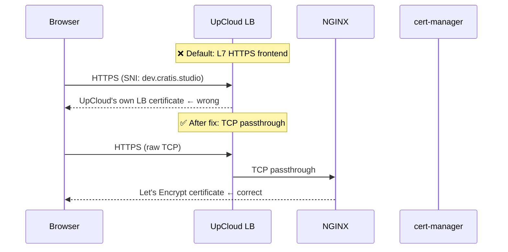
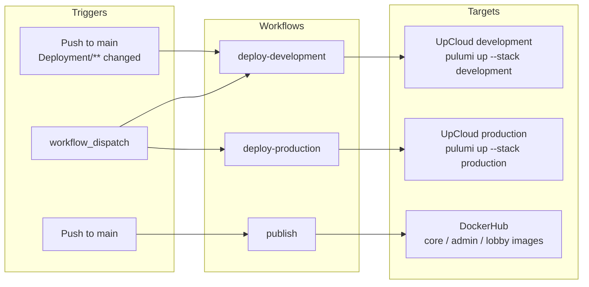

# From Zero to 56 Resources: Deploying Cratis Studio on UpCloud

**By Einar Ingebrigtsen** — Principal Architect, [Novanet](https://novanet.no) / Creator, [Cratis](https://github.com/cratis)

---

Data sovereignty is something I genuinely care about. Not as a compliance checkbox or a talking point, but as a first-principles belief that the organizations and people you work with should have meaningful control over where their data lives, who can access it, and under what legal regime.

That belief has become harder to maintain comfortably. Most cloud infrastructure — even for European companies — runs on American platforms, subject to American law. The CLOUD Act means that data stored on US-owned infrastructure can be demanded by US authorities regardless of where the servers physically sit. GDPR gives European citizens rights over their data; it doesn't give European companies rights over their infrastructure. Those are different things.

So when I advise customers on cloud architecture, I increasingly feel the weight of recommending platforms I can't fully vouch for from a data sovereignty standpoint. That needed to change — and that required a hands-on answer, not a vendor comparison spreadsheet. Real infrastructure, real workloads, real friction.

UpCloud was our answer. This is an honest account of what it took to go from zero to a fully running Kubernetes deployment — mistakes and all — because the only way I can confidently recommend a platform to customers is if I've done it myself.

---

## What we were deploying

[Cratis Studio](https://cratis.studio) is a collaborative tool for software development built around [Event Modeling](https://eventmodeling.org). Think Miro, but purpose-built for designing event-driven systems — not generic whiteboards. You sketch out the full lifecycle of your system as a timeline of commands, events and read models, and the tool helps your whole team stay aligned on what you're actually building.

The deployment we needed wasn't trivial. Beyond the application itself, we required:

- A managed Kubernetes cluster
- A self-hosted Docker registry (to keep images European)
- A MongoDB replica set with high-speed storage
- Automated backups to UpCloud object storage with rolling retention (hourly / daily / weekly / monthly)
- NGINX ingress + cert-manager + Let's Encrypt for TLS
- Grafana + Loki for observability
- OpenTelemetry Collector
- A Kubernetes dashboard
- OAuth2-based access control via GitHub teams

Two environments: `development` (from the `development` branch) and `production` (from `main`).

Here's how it all fits together:



---

## Why Pulumi and why C#

We've used Pulumi before and we like what it gives us: real programming languages, real abstractions, real tests. The alternative — YAML files describing desired state — works fine until it doesn't, at which point you're reading documentation for a DSL instead of writing code your team already knows.

Since our team lives in C#, that was the natural choice. Pulumi's C# support is solid. The codebase ended up as a proper .NET project with components like `KubernetesCluster`, `MongoDeployment`, `OAuth2Proxy`, `Ingresses`, each with typed arguments. It reads like an application, not a configuration file.

We also had GitHub Copilot along for the whole ride. More on that in a moment.

---

## The journey

### First check: verify your auth setup against the current dashboard

The very first thing we hit wasn't really an UpCloud problem — it was ours. The initial Pulumi code that had been scaffolded for us was using an older subaccount-based credential approach. UpCloud's API token documentation was current and easy to find; we just hadn't cross-checked the generated code against it before running. Once we did, switching to API tokens was straightforward.

The lesson isn't about UpCloud's documentation drifting — it's a reminder to verify your tooling's assumptions against the current platform before you start. Especially when AI-generated scaffolding is involved: it reflects what the model was trained on, not necessarily what shipped yesterday.

### Setting up the registry

Before the Kubernetes cluster could do anything useful, we needed a Docker registry to serve images from. UpCloud gives you straightforward VM-based infrastructure to build on, so the registry runs on a dedicated VM with a floating IP and a self-signed TLS certificate provisioned by Pulumi.

Getting Docker to trust that certificate across machines turned out to be the trickiest part. The process of distributing the certificate so that `docker login` would stop complaining about `x509: certificate signed by unknown authority` is genuinely tedious — it needs to happen on every machine that pushes or pulls. We documented it carefully so the second person through didn't have to figure it out from scratch.

### Kubernetes: CIDR surprises

Standing up the cluster itself was mostly smooth once we had the configuration right. We hit one bump worth noting.

Network CIDR overlap. UpCloud has a default private network in the `10.0.0.0/8` range, and the initial cluster network config used `10.0.0.0/24`, which overlapped directly with it. We had to choose a non-conflicting range. Simple in hindsight, but it cost a failed deploy to find out.

### The backup chicken-and-egg problem

This one was interesting. Our backup system writes to UpCloud Object Storage. To configure that in Pulumi we needed an access key. But the access key can only be created after the bucket exists. And the bucket is what Pulumi is supposed to create.

The naive answer is: create the bucket manually first, get your credentials, then paste them into config. We didn't love that.

The better answer — which we implemented — was to have Pulumi create the bucket *and* generate the access keys as part of the same deployment. Pulumi's output system handles this elegantly: the keys become `Output<string>` properties on the storage component and flow directly into the downstream configuration. No manual steps, no credentials to manage, no chicken, no egg.

```csharp
var accessKey = new ManagedObjectStorageUserAccessKey(
    $"backup-object-storage-access-key-{args.Environment}-g{args.AccessKeyGeneration}",
    new ManagedObjectStorageUserAccessKeyArgs
    {
        ServiceUuid = managedObjectStorage.Id,
        Username = userName,
        Status = "Active",
    },
    new CustomResourceOptions { DependsOn = [backupUser] });

AccessKeyId = Output.CreateSecret(accessKey.AccessKeyId);
SecretAccessKey = Output.CreateSecret(accessKey.SecretAccessKey);
```

The `AccessKeyGeneration` config value is worth calling out: incrementing it rotates the credentials on the next deploy without touching the resource name prefix — a simple but explicit rotation mechanism.

### DNS: CNAME, not A record

UpCloud's managed Kubernetes doesn't give you a static IP for the load balancer. It gives you a hostname like `lb-0afa36aa50364d92baa35e47ef2e72c5-1.upcloudlb.com`. That means your DNS records need to be CNAMEs, not A records. If your DNS provider (or your registrar's control panel) nudges you towards entering an IP address, you need to push back.

We updated our stack outputs and documentation to make this explicit. It's a detail, but it's the kind of detail that wastes an hour if you don't know it.

### Let's Encrypt and the load balancer TLS trap

This was our most involved debugging session and probably the most instructive.

We had cert-manager issuing Let's Encrypt certificates correctly. certs were appearing in Kubernetes secrets. NGINX had access to them. But when we hit a domain in the browser, the certificate we were getting back was issued for the UpCloud load balancer's own hostname, not our domain.

What was happening: UpCloud's cloud controller manager (CCM) was provisioning the load balancer with an HTTPS frontend — Layer 7 — using UpCloud's own default certificate. Traffic from the browser was being decrypted at the load balancer before it ever reached NGINX. Let's Encrypt was doing its job; NGINX was serving the right cert; the load balancer just wasn't letting it through.



The fix was setting TCP mode via an annotation on the NGINX controller's `LoadBalancer` service, expressed in Pulumi C# as:

```csharp
["service"] = new Dictionary<string, object>
{
    ["type"] = "LoadBalancer",
    ["annotations"] = new Dictionary<string, string>
    {
        ["service.beta.kubernetes.io/upcloud-load-balancer-config"] =
            """{"frontends":[
                {"name":"https","port":443,"mode":"tcp","default_backend":"port-443"},
                {"name":"http", "port":80, "mode":"tcp","default_backend":"port-80"}
            ],"backends":[
                {"name":"port-443","port":443},
                {"name":"port-80", "port":80}
            ]}""",
    },
},
```

Setting both frontends to `"mode": "tcp"` tells the CCM to pass raw TCP connections through to NGINX rather than terminating TLS at the load balancer. cert-manager's certificates started being served correctly immediately after.

One wrinkle: the UpCloud CCM honors this annotation only at load balancer creation time. Modifying an existing service's annotations doesn't reconfigure the load balancer. We had to delete the Kubernetes service entirely, wait for UpCloud to deprovision the old load balancer, then let Pulumi recreate it with the correct annotation from the start. Not complicated, but not obvious.

There was also a subtlety in the annotation format: the `default_backend` field expects a string (a backend name reference), not an inline object. Getting the JSON structure wrong produced a cryptic error from the CCM and another cycle of delete-and-recreate.

### OAuth2 via GitHub teams

We wanted protected endpoints that only members of specific GitHub organization teams could access. The answer here was [OAuth2-Proxy](https://github.com/oauth2-proxy/oauth2-proxy), deployed as two instances via Helm — one keyed to our `admin` team, one to our `operations` team — with NGINX forwarding through the appropriate proxy before serving the actual backend.

This part went largely to plan. The one gotcha: newer versions of the NGINX ingress (v1.9+) introduced an additional `annotations-risk-level` field alongside `allowSnippetAnnotations`. Setting only the latter isn't enough. We needed:

```csharp
["config"]["allow-snippet-annotations"] = "true",
["config"]["annotations-risk-level"] = "Critical"
```

The error message when you get this wrong points you at the admission webhook denying the annotation — helpful enough once you know what you're looking for.

### The Kubernetes dashboard subdomain issue

We added the Kubernetes dashboard for operational visibility. The dashboard's Helm chart (version 1.7.0) no longer supports the `--base-href` flag, which broke the subpath approach we'd initially tried. The fix was to give the dashboard its own subdomain (`console.dev.cratis.studio`) covered by our wildcard certificate rather than hosting it under a path. Tidier anyway.

One final small puzzle: the Helm release name for the dashboard gets a random hash suffix appended — `kubernetes-dashboard-development-fdaae6a3-kong-proxy` rather than the expected `kubernetes-dashboard-kong-proxy`. You can't know this name statically, so you can't hardcode it in the ingress backend. The fix is to use Pulumi's `.Apply()` to derive it at deploy time from the release name itself:

```csharp
// Service name is the Helm release name + "-kong-proxy"
// e.g. kubernetes-dashboard-development-fdaae6a3-kong-proxy
Name = dashboardRelease.Name.Apply(n => $"{n}-kong-proxy"),
```

This is the kind of thing that only shows up when you actually deploy — the Pulumi preview passes fine because the release name resolves to the expected value when the resource is live.

### The load balancer hostname instability problem

The CCM-provisioned load balancer has a hidden fragility we discovered the hard way: every time the NGINX Kubernetes service is deleted and recreated — which is the only way to apply a changed annotation, as noted earlier — the CCM treats it as a new service and provisions a *brand new* load balancer with a *brand new* random DNS hostname. Every CNAME record pointing at the old hostname breaks instantly.

This isn't hypothetical: the cycle of delete-and-recreate that the TCP annotation fix required triggered it precisely once during our work, and having all DNS stop resolving mid-debugging session is a memorable experience.

The fix is to invert ownership of the load balancer. Instead of letting the CCM provision it implicitly, pre-create the UpCloud load balancer as an explicit Pulumi `ClusterLoadBalancer` ComponentResource — complete with TCP frontends, backends, and static backend members pointing at every worker node. Then fix the NGINX NodePorts so the LB backend members' port references never drift between NGINX recreations:

```csharp
["nodePorts"] = new Dictionary<string, object>
{
    ["http"]  = args.HttpNodePort,   // fixed, e.g. 32080
    ["https"] = args.HttpsNodePort,  // fixed, e.g. 32443
},
```

The load balancer's `DnsName` is stable because the Pulumi resource itself persists across deploys. NGINX can be recreated as many times as needed without touching the DNS target. Point your CNAME records at the LB hostname once and never worry about it again.

### Discovering node IPs automatically

The Pulumi Kubernetes provider includes a `NodeList` resource type, and it looks like exactly the right tool for discovering worker node IPs at deploy time. It isn't: it's marked compatibility-only and cannot be used as a data source. Attempting to read from it blocks the deploy with a runtime exception about a required field.

The working approach is `Pulumi.Command.Local.Command`, which runs `kubectl get nodes` against the cluster using the UpCloud-fetched kubeconfig. The IPs are sorted before indexing so that node1/node2 assignments remain stable across runs, and `ClusterId` is passed as a trigger so the command re-runs and returns fresh IPs whenever the cluster is recreated:

```csharp
var nodeIPsCommand = new Command(
    $"get-node-ips-{args.Environment}",
    new CommandArgs
    {
        Create = "kubectl get nodes -o jsonpath='{.items[*].status.addresses" +
                 "[?(@.type==\"InternalIP\")].address}' --kubeconfig <(echo \"$KUBECONFIG_DATA\")",
        Environment = new InputMap<string>
        {
            ["KUBECONFIG_DATA"] = args.Kubeconfig,
        },
        Triggers = [args.ClusterId],
    });
```

The sorted IPs flow directly into the LB backend member configuration. No hardcoded IP addresses in stack config.

### The oauth2-proxy Helm v7.x credentials trap

This was the most subtle bug in the entire deployment, and the hardest to diagnose. We spent a full debugging session on it.

The standard advice for keeping secrets out of Helm release history is to create a Kubernetes Secret separately and reference it via the `existingSecret` value. We followed this exactly — created a Pulumi `Secret` resource with the GitHub OAuth credentials, set `existingSecret` to its name. Everything deployed without errors.

Then every OAuth authorization attempt returned a 404 from GitHub.

The cause: `existingSecret` **does not work** in oauth2-proxy Helm chart v7.x. The chart unconditionally creates its own `{release-name}` Secret seeded from `config.clientID`, `config.clientSecret`, and `config.cookieSecret` — defaulting those values to the literal placeholder string `XXXXXXX`. The Deployment's env vars always reference that chart-managed Secret. Your separately-created Secret is created, runs cleanly, and is referenced nowhere.

Both proxies were sending `client_id=XXXXXXX` to GitHub's authorize endpoint. GitHub accepts the URL (it shows the login page for any `client_id`), but returns 404 after the user logs in because no OAuth App with that ID exists. The error only appears in the browser after a full login cycle — there's nothing in the proxy logs, nothing in the Kubernetes events, nothing to indicate the credentials are wrong until you actually trace the raw redirect URL.

The fix is to abandon `existingSecret` entirely and pass credentials directly in Helm values:

```csharp
["config"] = new Dictionary<string, object>
{
    ["clientID"]     = clientId,
    ["clientSecret"] = clientSecret,
    ["cookieSecret"] = cookieSecret,
},
```

This means credentials appear in the Helm values that Pulumi stores in state. Pulumi marks them as secrets (they're `Output<string>` values wrapped with `Output.CreateSecret`), so they're encrypted in the state backend — not plaintext. It's a less clean separation than a standalone Secret, but it's the only option that actually works until the chart addresses this.

If you're using oauth2-proxy Helm chart v7.x and `existingSecret`, your credentials are `XXXXXXX`. Check this before wondering why GitHub returns 404.

### Cookie domain scoping for multiple proxies

With two oauth2-proxy instances — one guarding admin endpoints, one guarding operations — their cookie domains need different scopes. The admin proxy intentionally uses a broad cookie domain (`.dev.cratis.studio`) so its session cookie covers all subdomains, including the dashboard. The operations proxy should use a narrower domain (`.operations.dev.cratis.studio`) to contain its sessions.

A small bug in the Pulumi C# code applied the same subdomain-stripping formula to both:

```csharp
// Bug: both computed to .dev.cratis.studio
var adminCookieDomain      = "." + string.Join('.', adminDomain.Split('.').Skip(1));
var operationsCookieDomain = "." + string.Join('.', operationsDomain.Split('.').Skip(1));
```

The fix is direct:

```csharp
// Admin: broad, covers all subdomains including the dashboard
var adminCookieDomain      = "." + string.Join('.', adminDomain.Split('.').Skip(1));
// Operations: narrowed to its own subdomain
var operationsCookieDomain = "." + operationsDomain;
```

The practical impact: the operations session cookie was being scoped to the entire `.dev.cratis.studio` domain. In a private cluster with carefully controlled access this isn't catastrophic, but it's wrong — sessions should be isolated to their respective proxies.

### Kubernetes Dashboard: removing the second login prompt

After oauth2-proxy validates GitHub team membership and passes the request through, the Kubernetes Dashboard still presents its own login screen asking for a Bearer token. This is a second authentication step with no additional security value — the GitHub gate already established who the person is and whether they're authorised.

The fix is an NGINX `configuration-snippet` annotation on the dashboard ingress that injects the service account Bearer token automatically after oauth2-proxy passes the request:

```csharp
["nginx.ingress.kubernetes.io/configuration-snippet"] =
    AdminToken.Apply(token => $"proxy_set_header Authorization \"Bearer {token}\";"),
```

This requires `allowSnippetAnnotations = true` and `annotations-risk-level = Critical` in the NGINX Helm values — already in place from the OAuth2 setup earlier. After this change, authenticated users land directly on the Dashboard UI with no additional prompts. The Bearer token remains accessible as a Pulumi stack output for direct API access and debugging; it's simply no longer something users ever need to handle manually.

---

## Automating the deployment

Getting infrastructure to work manually is only half the job. The other half is making sure it stays working automatically. We set up three GitHub Actions workflows that together form the complete CI/CD pipeline.



**`deploy-development`** triggers automatically whenever changes to the `Deployment/` directory land on `main`. It installs the Pulumi CLI, runs `pulumi up` against the `development` stack, and uses GitHub's environment protection model to scope the secrets. A `concurrency` group with `cancel-in-progress: false` ensures deploys queue rather than stomp each other.

**`deploy-production`** is intentionally manual — `workflow_dispatch` only. It accepts an optional tag input; if none is given, it auto-generates a `YYYY.MM` version tag (incrementing a patch number if the month already has a release) and pushes it back to the repository. Production deployments are deliberate, not automatic.

**`publish`** handles Docker images. On every push to `main` it builds `core`, `admin`, and `lobby` images for both `linux/amd64` and `linux/arm64` and pushes them to DockerHub. The development cluster pulls the `latest-development` tag; production gets versioned tags matched to the release.

One thing worth calling out: the `UPCLOUD_TOKEN` secret is preferred, but the workflow falls back gracefully to `UPCLOUD_USERNAME` / `UPCLOUD_PASSWORD` if the token isn't set. That pattern kept us from breaking anything while we were iterating on the auth approach early on.

---

## Documentation as a first-class deliverable

One of the better decisions we made was to treat the setup documentation as a first-class part of the deployment — not something to write at the end, but something to keep accurate throughout.

We keep a `setup.md` file that covers every manual step required to go from a fresh clone to a running system: UpCloud API credentials, Pulumi state backend configuration, GitHub environment secrets, first-time secret seeding, kubeconfig setup, DNS configuration, and CA trust for the private registry. It's the kind of guide where one missing step means a confused second person spending an hour debugging what you already solved.

We updated it every time something changed — and things changed often. When `pulumi up` started automating NGINX and cert-manager setup that had previously been manual, the docs were updated immediately. When we discovered the load balancer uses a hostname rather than an IP, the DNS section was corrected. When the dashboard moved from a subpath to its own subdomain, the guide reflected that before the next person touched it.

The discipline is simple: if you had to figure something out, document it now, before you forget what the confusion actually was. The person who most benefits from good documentation is you, three months later.

We'd recommend the same approach to anyone setting up infrastructure like this: write the setup guide alongside the code, treat every debug session as a documentation opportunity, and use the AI assistant to keep things in sync — it's genuinely useful for that specific task.

---

## Copilot as co-pilot

We ran GitHub Copilot throughout the entire deployment process. It drove the initial Pulumi structure (from a GitHub Issue we raised with the full requirements), helped debug each error we encountered, and kept the documentation in sync with reality.

The honest report: it was genuinely useful for keeping momentum up, especially when we hit a new UpCloud-specific quirk that required reading API docs and translating that into correct Pulumi C# code. The LB annotation debugging in particular — reading the CCM source expectations and then generating the correct JSON format — would have taken considerably longer without that loop.

It got things wrong on occasion (the annotation format, the base-href approach), but the feedback cycle was tight enough that the corrections came quickly. It's a different kind of pair programming, and for infrastructure work on a platform you're learning, the pace advantage is real.

---

## The result

56 Pulumi resources deployed. 0 errors.

Both environments — `development` and `production` — follow the same code path with different config. The deployment is fully reproducible from a clean checkout. The backup system creates archives per-database and stores them in UpCloud object storage on the rolling schedule we specified. TLS works. OAuth2 works. Observability works.

---

## Lessons learned

The platform is solid. The Kubernetes offering is straightforward, and the integration with Pulumi via the [UpCloud provider](https://www.pulumi.com/registry/packages/upcloud/) works well. The documentation covers most of what you need, with some gaps around how the CCM interacts with load balancer configuration — if you're doing anything non-standard with networking, budget some time to read the API reference directly.

The specific things that caught us, so they don't catch you:

- **Check the dashboard for current auth requirements.** API credential formats can drift from what older documentation describes. The UpCloud dashboard is the source of truth.
- **Watch for CIDR conflicts.** UpCloud's default private network uses `10.0.0.0/8`. Make sure your cluster network config doesn't overlap.
- **Let's Encrypt requires TCP passthrough.** The CCM defaults to L7 HTTPS on the load balancer. You need to explicitly configure TCP mode via the `service.beta.kubernetes.io/upcloud-load-balancer-config` annotation — and the JSON format matters precisely.
- **Load balancer annotations only apply at creation time.** If you change the annotation on an existing service, nothing happens. You have to delete the service and let UpCloud reprovision the LB from scratch.
- **Pre-create the load balancer as a Pulumi resource.** Letting the CCM provision it implicitly means every NGINX service deletion creates a *new* LB with a new hostname, breaking DNS. Create it explicitly, fix the NGINX NodePorts, and your CNAME records are stable forever.
- **Pulumi's `NodeList` is not a data source.** The Kubernetes provider includes the type for compatibility but it cannot be read from at apply time. Use `Pulumi.Command.Local.Command` running `kubectl get nodes` instead — and pass `ClusterId` as a trigger so node IPs are refreshed when the cluster is recreated.
- **oauth2-proxy Helm chart v7.x ignores `existingSecret`.** The chart creates its own release-named Secret with placeholder `XXXXXXX` values and always mounts that — not the Secret you created. The symptom is a GitHub 404 after login with nothing in the proxy logs. Pass `config.clientID`, `config.clientSecret`, and `config.cookieSecret` directly in Helm values instead.
- **Cookie domains for multiple proxy instances need explicit scoping.** If you run both a broad admin proxy and a narrower operations proxy, verify the cookie domain formula independently for each. It's easy to apply the same stripping logic to both and silently produce the wrong scope.
- **The Kubernetes Dashboard has its own login prompt behind your OAuth proxy.** Eliminate it with an NGINX `configuration-snippet` that injects the service account Bearer token automatically. GitHub team membership becomes the only gate.

None of these are blockers. They're the kind of friction you hit once. After that, the deployment runs repeatably and everything behaves as expected.

For teams that take data sovereignty seriously — and I believe more teams should — UpCloud delivers what it promises: capable European infrastructure, transparent pricing, and a Kubernetes platform you can build real production workloads on. That's what I'll be telling my customers.

---

## About the author

**Einar Ingebrigtsen** is a technical advisor at [Novanet](https://novanet.no), a Norwegian software consultancy, and the creator of [Cratis](https://cratis.io) — an open-source event sourcing and CQRS platform for .NET. He has spent over two decades building distributed systems and advising organizations on cloud architecture, developer experience, and software design. He writes at [ingebrigtsen.blog](https://ingebrigtsen.blog).
