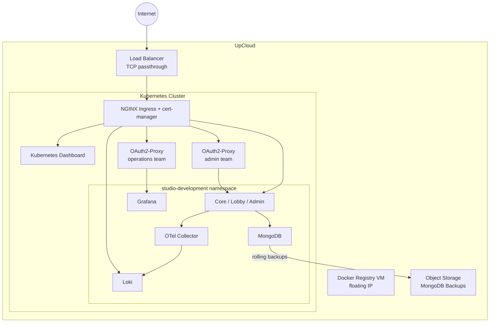
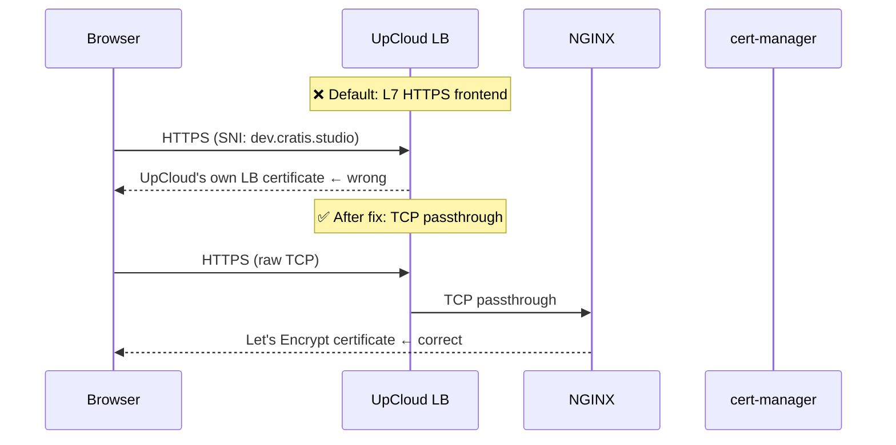

# From Zero to 56 Resources: Deploying Cratis Studio on UpCloud

**By Einar Ingebrigtsen** — Principal Architect, [Novanet](https://novanet.no) / Creator, [Cratis](https://github.com/cratis)

---

Data sovereignty is something I genuinely care about. Not as a compliance checkbox or a talking point, but as a first-principles belief that the organizations and people you work with should have meaningful control over where their data lives, who can access it, and under what legal regime.

That belief has become harder to maintain comfortably. Most cloud infrastructure — even for European companies — runs on American platforms, subject to American law. The CLOUD Act means that data stored on US-owned infrastructure can be demanded by US authorities regardless of where the servers physically sit. GDPR gives European citizens rights over their data; it doesn't give European companies rights over their infrastructure. Those are different things.

So when I advise customers on cloud architecture, I increasingly feel the weight of recommending platforms I can't fully vouch for from a data sovereignty standpoint. That needed to change — and that required a hands-on answer, not a vendor comparison spreadsheet. Real infrastructure, real workloads, real friction.

UpCloud was our answer. This is an honest account of what it took to go from zero to a fully running Kubernetes deployment — mistakes and all — because the only way I can confidently recommend a platform to customers is if I've done it myself.

---

## What we were deploying

[Cratis Studio](https://cratis.studio) is a collaborative tool for software development built around [Event Modeling](https://eventmodeling.org). Think Miro, but purpose-built for designing event-driven systems — not generic whiteboards. You sketch out the full lifecycle of your system as a timeline of commands, events and read models, and the tool helps your whole team stay aligned on what you're actually building.

The deployment we needed wasn't trivial. Beyond the application itself, we required:

- A managed Kubernetes cluster
- A self-hosted Docker registry (to keep images European)
- A MongoDB replica set with high-speed storage
- Automated backups to UpCloud object storage with rolling retention (hourly / daily / weekly / monthly)
- NGINX ingress + cert-manager + Let's Encrypt for TLS
- Grafana + Loki for observability
- OpenTelemetry Collector
- A Kubernetes dashboard
- OAuth2-based access control via GitHub teams

Two environments: `development` (from the `development` branch) and `production` (from `main`).

Here's how it all fits together:



---

## Why Pulumi and why C#

We've used Pulumi before and we like what it gives us: real programming languages, real abstractions, real tests. The alternative — YAML files describing desired state — works fine until it doesn't, at which point you're reading documentation for a DSL instead of writing code your team already knows.

Since our team lives in C#, that was the natural choice. Pulumi's C# support is solid. The codebase ended up as a proper .NET project with components like `KubernetesCluster`, `MongoDeployment`, `OAuth2Proxy`, `Ingresses`, each with typed arguments. It reads like an application, not a configuration file.

We also had GitHub Copilot along for the whole ride. More on that in a moment.

---

## The journey

### First check: verify your auth setup against the current dashboard

The very first thing we hit wasn't really an UpCloud problem — it was ours. The initial Pulumi code that had been scaffolded for us was using an older subaccount-based credential approach. UpCloud's API token documentation was current and easy to find; we just hadn't cross-checked the generated code against it before running. Once we did, switching to API tokens was straightforward.

The lesson isn't about UpCloud's documentation drifting — it's a reminder to verify your tooling's assumptions against the current platform before you start. Especially when AI-generated scaffolding is involved: it reflects what the model was trained on, not necessarily what shipped yesterday.

### Setting up the registry

Before the Kubernetes cluster could do anything useful, we needed a Docker registry to serve images from. UpCloud gives you straightforward VM-based infrastructure to build on, so the registry runs on a dedicated VM with a floating IP and a self-signed TLS certificate provisioned by Pulumi.

Getting Docker to trust that certificate across machines turned out to be the trickiest part. The process of distributing the certificate so that `docker login` would stop complaining about `x509: certificate signed by unknown authority` is genuinely tedious — it needs to happen on every machine that pushes or pulls. We documented it carefully so the second person through didn't have to figure it out from scratch.

### Kubernetes: CIDR surprises

Standing up the cluster itself was mostly smooth once we had the configuration right. We hit one bump worth noting.

Network CIDR overlap. UpCloud has a default private network in the `10.0.0.0/8` range, and the initial cluster network config used `10.0.0.0/24`, which overlapped directly with it. We had to choose a non-conflicting range. Simple in hindsight, but it cost a failed deploy to find out.

### The backup chicken-and-egg problem

This one was interesting. Our backup system writes to UpCloud Object Storage. To configure that in Pulumi we needed an access key. But the access key can only be created after the bucket exists. And the bucket is what Pulumi is supposed to create.

The naive answer is: create the bucket manually first, get your credentials, then paste them into config. We didn't love that.

The better answer — which we implemented — was to have Pulumi create the bucket *and* generate the access keys as part of the same deployment. Pulumi's output system handles this elegantly: the keys become `Output<string>` properties on the storage component and flow directly into the downstream configuration. No manual steps, no credentials to manage, no chicken, no egg.

```csharp
var accessKey = new ManagedObjectStorageUserAccessKey(
    $"backup-object-storage-access-key-{args.Environment}-g{args.AccessKeyGeneration}",
    new ManagedObjectStorageUserAccessKeyArgs
    {
        ServiceUuid = managedObjectStorage.Id,
        Username = userName,
        Status = "Active",
    },
    new CustomResourceOptions { DependsOn = [backupUser] });

AccessKeyId = Output.CreateSecret(accessKey.AccessKeyId);
SecretAccessKey = Output.CreateSecret(accessKey.SecretAccessKey);
```

The `AccessKeyGeneration` config value is worth calling out: incrementing it rotates the credentials on the next deploy without touching the resource name prefix — a simple but explicit rotation mechanism.

### DNS: CNAME, not A record

UpCloud's managed Kubernetes doesn't give you a static IP for the load balancer. It gives you a hostname like `lb-0afa36aa50364d92baa35e47ef2e72c5-1.upcloudlb.com`. That means your DNS records need to be CNAMEs, not A records. If your DNS provider (or your registrar's control panel) nudges you towards entering an IP address, you need to push back.

We updated our stack outputs and documentation to make this explicit. It's a detail, but it's the kind of detail that wastes an hour if you don't know it.

### Let's Encrypt and the load balancer TLS trap

This was our most involved debugging session and probably the most instructive.

We had cert-manager issuing Let's Encrypt certificates correctly. certs were appearing in Kubernetes secrets. NGINX had access to them. But when we hit a domain in the browser, the certificate we were getting back was issued for the UpCloud load balancer's own hostname, not our domain.

What was happening: UpCloud's cloud controller manager (CCM) was provisioning the load balancer with an HTTPS frontend — Layer 7 — using UpCloud's own default certificate. Traffic from the browser was being decrypted at the load balancer before it ever reached NGINX. Let's Encrypt was doing its job; NGINX was serving the right cert; the load balancer just wasn't letting it through.



The fix was setting TCP mode via an annotation on the NGINX controller's `LoadBalancer` service, expressed in Pulumi C# as:

```csharp
["service"] = new Dictionary<string, object>
{
    ["type"] = "LoadBalancer",
    ["annotations"] = new Dictionary<string, string>
    {
        ["service.beta.kubernetes.io/upcloud-load-balancer-config"] =
            """{"frontends":[
                {"name":"https","port":443,"mode":"tcp","default_backend":"port-443"},
                {"name":"http", "port":80, "mode":"tcp","default_backend":"port-80"}
            ],"backends":[
                {"name":"port-443","port":443},
                {"name":"port-80", "port":80}
            ]}""",
    },
},
```

Setting both frontends to `"mode": "tcp"` tells the CCM to pass raw TCP connections through to NGINX rather than terminating TLS at the load balancer. cert-manager's certificates started being served correctly immediately after.

One wrinkle: the UpCloud CCM honors this annotation only at load balancer creation time. Modifying an existing service's annotations doesn't reconfigure the load balancer. We had to delete the Kubernetes service entirely, wait for UpCloud to deprovision the old load balancer, then let Pulumi recreate it with the correct annotation from the start. Not complicated, but not obvious.

There was also a subtlety in the annotation format: the `default_backend` field expects a string (a backend name reference), not an inline object. Getting the JSON structure wrong produced a cryptic error from the CCM and another cycle of delete-and-recreate.

### OAuth2 via GitHub teams

We wanted protected endpoints that only members of specific GitHub organization teams could access. The answer here was [OAuth2-Proxy](https://github.com/oauth2-proxy/oauth2-proxy), deployed as two instances via Helm — one keyed to our `admin` team, one to our `operations` team — with NGINX forwarding through the appropriate proxy before serving the actual backend.

This part went largely to plan. The one gotcha: newer versions of the NGINX ingress (v1.9+) introduced an additional `annotations-risk-level` field alongside `allowSnippetAnnotations`. Setting only the latter isn't enough. We needed:

```csharp
["config"]["allow-snippet-annotations"] = "true",
["config"]["annotations-risk-level"] = "Critical"
```

The error message when you get this wrong points you at the admission webhook denying the annotation — helpful enough once you know what you're looking for.

### The Kubernetes dashboard subdomain issue

We added the Kubernetes dashboard for operational visibility. The dashboard's Helm chart (version 1.7.0) no longer supports the `--base-href` flag, which broke the subpath approach we'd initially tried. The fix was to give the dashboard its own subdomain (`console.dev.cratis.studio`) covered by our wildcard certificate rather than hosting it under a path. Tidier anyway.

One final small puzzle: the Helm release name for the dashboard gets a random hash suffix appended — `kubernetes-dashboard-development-fdaae6a3-kong-proxy` rather than the expected `kubernetes-dashboard-kong-proxy`. You can't know this name statically, so you can't hardcode it in the ingress backend. The fix is to use Pulumi's `.Apply()` to derive it at deploy time from the release name itself:

```csharp
// Service name is the Helm release name + "-kong-proxy"
// e.g. kubernetes-dashboard-development-fdaae6a3-kong-proxy
Name = dashboardRelease.Name.Apply(n => $"{n}-kong-proxy"),
```

This is the kind of thing that only shows up when you actually deploy — the Pulumi preview passes fine because the release name resolves to the expected value when the resource is live.

---

## Copilot as co-pilot

We ran GitHub Copilot throughout the entire deployment process. It drove the initial Pulumi structure (from a GitHub Issue we raised with the full requirements), helped debug each error we encountered, and kept the documentation in sync with reality.

The honest report: it was genuinely useful for keeping momentum up, especially when we hit a new UpCloud-specific quirk that required reading API docs and translating that into correct Pulumi C# code. The LB annotation debugging in particular — reading the CCM source expectations and then generating the correct JSON format — would have taken considerably longer without that loop.

It got things wrong on occasion (the annotation format, the base-href approach), but the feedback cycle was tight enough that the corrections came quickly. It's a different kind of pair programming, and for infrastructure work on a platform you're learning, the pace advantage is real.

---

## The result

56 Pulumi resources deployed. 0 errors.

Both environments — `development` and `production` — follow the same code path with different config. The deployment is fully reproducible from a clean checkout. The backup system creates archives per-database and stores them in UpCloud object storage on the rolling schedule we specified. TLS works. OAuth2 works. Observability works.

---

## Lessons learned

The platform is solid. The Kubernetes offering is straightforward, and the integration with Pulumi via the [UpCloud provider](https://www.pulumi.com/registry/packages/upcloud/) works well. The documentation covers most of what you need, with some gaps around how the CCM interacts with load balancer configuration — if you're doing anything non-standard with networking, budget some time to read the API reference directly.

The specific things that caught us, so they don't catch you:

- **Check the dashboard for current auth requirements.** API credential formats can drift from what older documentation describes. The UpCloud dashboard is the source of truth.
- **Watch for CIDR conflicts.** UpCloud's default private network uses `10.0.0.0/8`. Make sure your cluster network config doesn't overlap.
- **Let's Encrypt requires TCP passthrough.** The CCM defaults to L7 HTTPS on the load balancer. You need to explicitly configure TCP mode via the `service.beta.kubernetes.io/upcloud-load-balancer-config` annotation — and the JSON format matters precisely.
- **Load balancer annotations only apply at creation time.** If you change the annotation on an existing service, nothing happens. You have to delete the service and let UpCloud reprovision the LB from scratch.

None of these are blockers. They're the kind of friction you hit once. After that, the deployment runs repeatably and everything behaves as expected.

For teams that take data sovereignty seriously — and I believe more teams should — UpCloud delivers what it promises: capable European infrastructure, transparent pricing, and a Kubernetes platform you can build real production workloads on. That's what I'll be telling my customers.

---

## About the author

**Einar Ingebrigtsen** is a technical advisor at [Novanet](https://novanet.no), a Norwegian software consultancy, and the creator of [Cratis](https://cratis.io) — an open-source event sourcing and CQRS platform for .NET. He has spent over two decades building distributed systems and advising organizations on cloud architecture, developer experience, and software design. He writes at [ingebrigtsen.blog](https://ingebrigtsen.blog).
