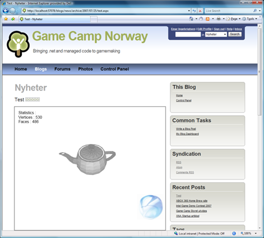

I figured I just jump into it; creating a Community Server 2007 module for rendering Silverlight content.

It all started up yesterday as a simple thing, but I figured that I didn't feel comfortable with the way the plugin system worked in Community Server, so I created a small abstraction from it to make it feel more right for me. :)   It's all based upon attributes instead of hooking up events. The reason I started doing the abstraction was that I have a couple of modules I need in the pipeline and wanted to simplify stuff I will be needing for all modules, such as filtering for ApplicationType.

The module code turns out as follows (I've attached the entire project with source and binaries)

<table style="background-color:#f2f2f2;border:#e5e5e5 1px solid;" border="0" width="100%" cellspacing="0" cellpadding="0"><tbody><tr style="vertical-align:top;line-height:normal;"><td style="width:40px;text-align:right;"><pre style="border-right:#e7e7e7 1px solid;font-size:11px;margin:0;color:gray;font-family:courier new;padding:2px;">1
2
3
4
5
6
7
8
9
10
11
12
13
14
15
16
17
18
19
20
21
22
23
24
25
26
27
28
29
30
31
32
33
34
35
36
37
38
39
40
41
42
43
44
45
46
47
48
49
50
</pre></td><td><pre style="margin:0;padding:2px 2px 2px 8px;">&nbsp;&nbsp;[Module("SilverlightModule")]
&nbsp;&nbsp;public class SilverlightModule : BaseModule
&nbsp;&nbsp;{
&nbsp;&nbsp;&nbsp;&nbsp;private static readonly string SilverlightScript = "Silverlight";
&nbsp;&nbsp;&nbsp;&nbsp;private static readonly string SilverlightApplicationScript = 
&nbsp;&nbsp;&nbsp;&nbsp;&nbsp;&nbsp;&nbsp;&nbsp;&nbsp;&nbsp;&nbsp;&nbsp;&nbsp;&nbsp;&nbsp;&nbsp;&nbsp;&nbsp;&nbsp;&nbsp;&nbsp;&nbsp;&nbsp;&nbsp;"SilverlightApplication";

&nbsp;&nbsp;&nbsp;&nbsp;[Method(MethodType.PreRender)]
&nbsp;&nbsp;&nbsp;&nbsp;[MethodType(MethodType.PreRender)]
&nbsp;&nbsp;&nbsp;&nbsp;[ApplicationType(ApplicationType.Weblog)]
&nbsp;&nbsp;&nbsp;&nbsp;[ApplicationType(ApplicationType.ContentManagement)]
&nbsp;&nbsp;&nbsp;&nbsp;public string Render(string protocol,string xamlUri)
&nbsp;&nbsp;&nbsp;&nbsp;{
&nbsp;&nbsp;&nbsp;&nbsp;&nbsp;&nbsp;string completeUri = protocol + ":" + xamlUri;

&nbsp;&nbsp;&nbsp;&nbsp;&nbsp;&nbsp;Page page = MethodContext.Current.Page;

&nbsp;&nbsp;&nbsp;&nbsp;&nbsp;&nbsp;if (!page.ClientScript.
&nbsp;&nbsp;&nbsp;&nbsp;&nbsp;&nbsp;&nbsp;&nbsp;&nbsp;&nbsp;IsClientScriptBlockRegistered(SilverlightScript))
&nbsp;&nbsp;&nbsp;&nbsp;&nbsp;&nbsp;{
&nbsp;&nbsp;&nbsp;&nbsp;&nbsp;&nbsp;&nbsp;&nbsp;page.ClientScript.
&nbsp;&nbsp;&nbsp;&nbsp;&nbsp;&nbsp;&nbsp;&nbsp;&nbsp;&nbsp;RegisterClientScriptBlock(&nbsp;&nbsp;typeof(SilverlightModule), 
&nbsp;&nbsp;&nbsp;&nbsp;&nbsp;&nbsp;&nbsp;&nbsp;&nbsp;&nbsp;&nbsp;&nbsp;&nbsp;&nbsp;&nbsp;&nbsp;&nbsp;&nbsp;&nbsp;&nbsp;&nbsp;&nbsp;&nbsp;&nbsp;SilverlightScript, 
&nbsp;&nbsp;&nbsp;&nbsp;&nbsp;&nbsp;&nbsp;&nbsp;&nbsp;&nbsp;&nbsp;&nbsp;&nbsp;&nbsp;&nbsp;&nbsp;&nbsp;&nbsp;&nbsp;&nbsp;&nbsp;&nbsp;&nbsp;&nbsp;Resources.Silverlight, true);
&nbsp;&nbsp;&nbsp;&nbsp;&nbsp;&nbsp;}

&nbsp;&nbsp;&nbsp;&nbsp;&nbsp;&nbsp;if (!page.ClientScript.
&nbsp;&nbsp;&nbsp;&nbsp;&nbsp;&nbsp;&nbsp;&nbsp;&nbsp;&nbsp;IsClientScriptBlockRegistered(SilverlightApplicationScript))
&nbsp;&nbsp;&nbsp;&nbsp;&nbsp;&nbsp;{
&nbsp;&nbsp;&nbsp;&nbsp;&nbsp;&nbsp;&nbsp;&nbsp;page.ClientScript.
&nbsp;&nbsp;&nbsp;&nbsp;&nbsp;&nbsp;&nbsp;&nbsp;&nbsp;&nbsp;RegisterClientScriptBlock(&nbsp;&nbsp;typeof(SilverlightModule), 
&nbsp;&nbsp;&nbsp;&nbsp;&nbsp;&nbsp;&nbsp;&nbsp;&nbsp;&nbsp;&nbsp;&nbsp;&nbsp;&nbsp;&nbsp;&nbsp;&nbsp;&nbsp;&nbsp;&nbsp;&nbsp;&nbsp;&nbsp;&nbsp;SilverlightApplicationScript, 
&nbsp;&nbsp;&nbsp;&nbsp;&nbsp;&nbsp;&nbsp;&nbsp;&nbsp;&nbsp;&nbsp;&nbsp;&nbsp;&nbsp;&nbsp;&nbsp;&nbsp;&nbsp;&nbsp;&nbsp;&nbsp;&nbsp;&nbsp;&nbsp;Resources.SilverlightApplication, 
&nbsp;&nbsp;&nbsp;&nbsp;&nbsp;&nbsp;&nbsp;&nbsp;&nbsp;&nbsp;&nbsp;&nbsp;&nbsp;&nbsp;&nbsp;&nbsp;&nbsp;&nbsp;&nbsp;&nbsp;&nbsp;&nbsp;&nbsp;&nbsp;true);
&nbsp;&nbsp;&nbsp;&nbsp;&nbsp;&nbsp;}

&nbsp;&nbsp;&nbsp;&nbsp;&nbsp;&nbsp;Guid applicationGuid = Guid.NewGuid();

&nbsp;&nbsp;&nbsp;&nbsp;&nbsp;&nbsp;string hostName = "SilverlightControlHost_"+applicationGuid.ToString();

&nbsp;&nbsp;&nbsp;&nbsp;&nbsp;&nbsp;completeUri = completeUri.Trim();

&nbsp;&nbsp;&nbsp;&nbsp;&nbsp;&nbsp;return 
&nbsp;&nbsp;&nbsp;&nbsp;&nbsp;&nbsp;"&lt;div id="" + hostName + "" style="background-color:Black" &gt;" +
&nbsp;&nbsp;&nbsp;&nbsp;&nbsp;&nbsp;"&lt;script type="text/javascript" style="background-color:Black"&gt;" +
&nbsp;&nbsp;&nbsp;&nbsp;&nbsp;&nbsp;"createSilverlight(""+completeUri+"",""+applicationGuid.ToString()+"");" +
&nbsp;&nbsp;&nbsp;&nbsp;&nbsp;&nbsp;"&lt;/script&gt;" +
&nbsp;&nbsp;&nbsp;&nbsp;&nbsp;&nbsp;"&lt;/div&gt;";
&nbsp;&nbsp;&nbsp;&nbsp;}
&nbsp;&nbsp;}</pre></td></tr></tbody></table>

**Installation instructions :**

Copy the binary (DoLittle.CS.Modules.dll) into the bin directory of your Community Server installation. Add the following line to your communityserver.config file :

<add name\="SilverlightModule" type\="DoLittle.CS.Modules.SilverlightModule, DoLittle.CS.Modules"/>

Then you have the SilverlightModule up and running.

To use it you simple write \[SilverlightModule: protocol:uri\] in your editor.

protocol : http, https uri : The uri for the XAML to use

Sample : \[SilverlightModule: [http://www.dolittle.com/Silverlight/3D/Page.xaml](http://localhost:8080/silverlight/3D/Page.xaml)\]

Remember to use the unlink button for the Uri. Community Server editor and most other editors will automatically translate the Uri and add a href around it.
