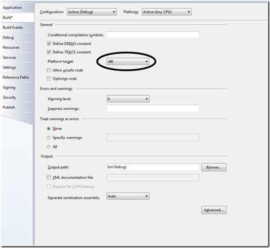

There is still a lot of libraries and technologies out there that does not work running in a 64 bit process. Take the Jet engine and utilizing it from OleDb; if you have a application that runs in a 64 bit native context, you will be given an error message that says that there is no OleDb provider for the provider specified in the connectionstring.

Another example is the use of the ExploreOM assembly in BizTalk 2006 used for controlling the BizTalk server programmatically. Used from a 64 bit native context the application will throw an exception.

How can one get around this problem?  Well. It's actually very simple, if you're willing to give away having a native 64 bit application or be invariant to the CPU. By choosing x86 as the CPU when compiling your .net application, you'll be able to still use 32 bit only facilities. The process will then run in a 32 bit context and therefor run smoothly without any issues. Remember that it is only the executable (entry point) that needs to be compiled with this option.

You find the option under Project Properties -> Build -> Platform target.

