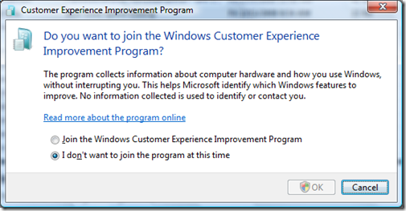

This is probably not a show stopper for most of you, more of an interesting bug..

You are by default declined to not join the customer experience program.. :)  The OK button is disabled.  
By clicking the "Joint the Windows...." radiobutton and then click the "I don't want..." radiobutton, you're able to click the OK button.

An effective way to get people to join the Customer Experience Improvement Program, I'm sure..
