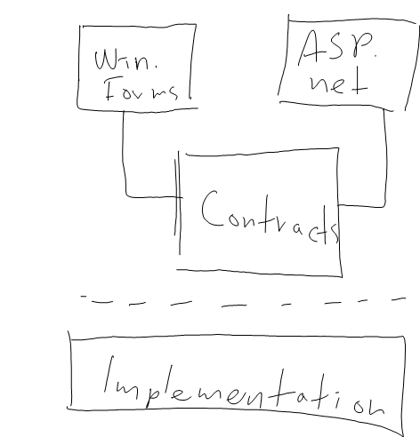

I've been working lately a bit with WCF and find it very exciting and a true step up from .net remoting and .net WebServices. The scenario we're having is that we have one server application and at the moment two front-ends; Windows Forms and a ASP.net Web application. For our Windows Forms based application we need to be able to host our services in-process as well as on a server. In addition we do not want to be directly coupled to WCF for our contracts, so the declarative way of doing things with attributes (ServiceContractAttribute, OperationContractAttribute and so forth) is not acceptable, or at least not the optimal solution for our services to be exposed. Another issue I ran into was the lack of surrogate support for well known types such as XmlNode and XmlDocument and others.

With this in mind I've been working on a prototype were we share an assembly with all our contracts and then have our own ServiceModel component that will also be shared between the projects. This will then serve as our entrypoint for our services. When we have this principal with a shared assembly with all our interfaces, it is fair to say that the contracts and it's operations are implicitly exposed and available, in other words; attribute decorations should really not be necessary.

The picture looks something like this (finally I got to use my tablet for blogging. :) )  :



In order to get this to work one need to have the ability to create service contracts programatically and be able to serialize and deserialize datacontracts without having to decorate them with different contract attributes or create surrogates. Fortunately, WCF has been made to be as flexible as possible and give 100% control to the developer, so it is pretty straight forward to do this.

First we start by setting up our host :

```
ServiceHost host = new ServiceHost(serviceType, this.BaseAddress);
WSHttpBinding binding = new WSHttpBinding(SecurityMode.None);

```

We need to add the ServiceMetaDataBehavior and take advantage of a method on it called ExportContract(). This method will export the contract for the service to the endpoint.

```
ServiceMetadataBehavior smb = new ServiceMetadataBehavior();
smb.HttpGetEnabled = true;
smb.MetadataExporter.ExportContract(contractDescription);
host.Description.Behaviors.Add(smb);

```

And then we add our endpoint :

```
ServiceEndpoint endPoint = new ServiceEndpoint(
    contractDescription,
    binding,
    new EndpointAddress(this.BaseAddress));

host.Description.Endpoints.Add(endPoint);

```

Then we open our host and make it start listening for requests - note : this implementation pretty much turns off security, probably something one should look into. :)

```
host.Authorization.PrincipalPermissionMode = PrincipalPermissionMode.None;
host.Open();
```

As you've probably noticed, we need code to generate the contract description needed for the above implementation. A quick and dirty implementation should look like this :

> ```
> public class ServiceHoster
> {
>     public static readonly ServiceHoster Instance = new ServiceHoster();
>     public static readonly string DefaultNamespace = "http://www.dolittle.com/";
> 
>     private readonly List<System.ServiceModel.ServiceHost> _hosts;
> 
>     private ServiceHoster()
>     {
>         this._hosts = new List<System.ServiceModel.ServiceHost>();
>         this.Namespace = DefaultNamespace;
>     }
> 
>     public void ShutDown()
>     {
>         foreach (ServiceHost host in this._hosts)
>         {
>             host.Close();
>         }
>     }
> 
>     public string Namespace { get; set; }
>     public Uri BaseAddress { get; set; }
> 
>     private ContractDescription CreateContractDescription(Type contractType, Type serviceType)
>     {
>         ContractDescription contractDescription = new ContractDescription(contractType.Name);
>         contractDescription.ProtectionLevel = ProtectionLevel.None;
>         contractDescription.ContractType = contractType;
>         contractDescription.ConfigurationName = contractType.FullName;
>         contractDescription.SessionMode = SessionMode.NotAllowed;
> 
>         MethodInfo[] methods = contractType.GetMethods();
> 
>         foreach (MethodInfo method in methods)
>         {
>             OperationDescription operationDescription =
>                 new OperationDescription(method.Name, contractDescription);
> 
>             string messagePath = this.Namespace + contractType.Name + "/";
>             string requestName = method.Name;
>             string responseName = method.Name + "Response";
> 
>             string requestPath = messagePath + requestName;
>             string responsePath = messagePath + responseName + "Response";
>             string resultName = requestName + "Result";
> 
>             MessageDescription inputMessage = new MessageDescription(requestPath, MessageDirection.Input);
>             inputMessage.Body.WrapperName = requestName;
>             inputMessage.Body.WrapperNamespace = this.Namespace;
> 
>             ParameterInfo[] parameters = method.GetParameters();
>             foreach (ParameterInfo parameter in parameters)
>             {
>                 MessagePartDescription messagePartDescription =
>                     new MessagePartDescription(parameter.Name, this.Namespace);
>                 messagePartDescription.Type = parameter.ParameterType;
>                 inputMessage.Body.Parts.Add(messagePartDescription);
>             }
>             operationDescription.Messages.Add(inputMessage);
> 
>             if (null != method.ReturnType)
>             {
>                 MessageDescription outputMessage =
>                     new MessageDescription(responsePath, MessageDirection.Output);
>                 outputMessage.Body.ReturnValue = new MessagePartDescription(resultName, this.Namespace);
>                 outputMessage.Body.ReturnValue.Type = method.ReturnType;
>                 outputMessage.Body.WrapperName = responseName;
>                 outputMessage.Body.WrapperNamespace = this.Namespace;
>                 operationDescription.Messages.Add(outputMessage);
>             }
> 
>             contractDescription.Operations.Add(operationDescription);
> 
>             operationDescription.Behaviors.Add(new ServiceOperationBehavior(method));
> 
> 
>             OperationBehaviorAttribute operationBehaviourAttribute = new OperationBehaviorAttribute();
>             operationDescription.Behaviors.Add(operationBehaviourAttribute);
> 
>             DataContractSerializerOperationBehavior d =
>                 new DataContractSerializerOperationBehavior(operationDescription);
>             operationDescription.Behaviors.Add(d);
>         }
> 
>         return contractDescription;
>     }
> 
>     public void AddService<T>(Type serviceType)
>     {
>         Type contractType = typeof(T);
> 
>         ServiceHost host = new ServiceHost(serviceType, this.BaseAddress);
>         WSHttpBinding binding = new WSHttpBinding(SecurityMode.None);
> 
>         ContractDescription contractDescription = this.CreateContractDescription(contractType, serviceType);
> 
>         ServiceEndpoint endPoint = new ServiceEndpoint(
>             contractDescription,
>             binding,
>             new EndpointAddress(this.BaseAddress));
> 
>         host.Description.Endpoints.Add(endPoint);
> 
>         ServiceMetadataBehavior smb = new ServiceMetadataBehavior();
>         smb.HttpGetEnabled = true;
>         smb.MetadataExporter.ExportContract(contractDescription);
>         host.Description.Behaviors.Add(smb);
> 
> 
> 
>         host.Authorization.PrincipalPermissionMode = PrincipalPermissionMode.None;
>         host.Open();
>     }
> }
> 
> ```

As you can see it is pretty straight forward defining the contracts and its messages. The magic is located at the end of the method when all the behaviors are added. Behaviors are the real magic of WCF, they pretty much make WCF tick. :)  We add a ServiceOperationBehavior that we'll see the code for below, in addition we add some behaviors that ship with WCF; OperationBehaviorAttribute and DataContractSerializerOperationBehavior. The latter of the two will most likely be removed in Part 2 of this article when I will post that. The reason is that we will have to create our own DataContract serializer in order to be able to serialize any data types as mentioned earlier.

The purpose of the ServiceOperationBehavior is to intercept the handling of the request and response for the services we're exposing. In this article we use the default XML serializer as you can see in the ApplyDispatchBehavior() method. Again for this example we are doing things very very simple and we don't pay attention to things like security.

```
public class ServiceOperationBehavior : IOperationBehavior
{
    private MethodInfo _methodInfo;

    private IOperationBehavior _innerBehavior;


    internal ServiceOperationBehavior(MethodInfo methodInfo)
    {
        this._methodInfo = methodInfo;
    }

    #region IOperationBehavior Members

    public void AddBindingParameters(
        OperationDescription operationDescription, BindingParameterCollection bindingParameters)
    {
    }

    public void ApplyClientBehavior(OperationDescription operationDescription,
        ClientOperation clientOperation)
    {
    }

    public void ApplyDispatchBehavior(OperationDescription operationDescription,
        DispatchOperation dispatchOperation)
    {
        if (null == this._innerBehavior)
        {
            this._innerBehavior =
                new XmlSerializerOperationBehavior(operationDescription) as IOperationBehavior;
        }

        this._innerBehavior.ApplyDispatchBehavior(operationDescription, dispatchOperation);

        dispatchOperation.DeserializeRequest = true;
        dispatchOperation.SerializeReply = true;

        dispatchOperation.Invoker = new ServiceInvoker(this._methodInfo);
    }

    public void Validate(OperationDescription operationDescription)
    {
    }

    #endregion
}

```

In the ApplyDispatchBehavior method we setup an invoker to handle the invocation of the methods. The invoker looks like this :

```
public class ServiceInvoker : IOperationInvoker
{
    private readonly MethodInfo _methodInfo;

    public ServiceInvoker(MethodInfo methodInfo)
    {
        this._methodInfo = methodInfo;
    }

    #region IOperationInvoker Members

    public object[] AllocateInputs()
    {
        return new object[0];
    }

    public object Invoke(object instance, object[] inputs, out object[] outputs)
    {
        outputs = new object[0];
        object returnValue = this._methodInfo.Invoke(instance, inputs);
        return returnValue;

    }

    public IAsyncResult InvokeBegin(object instance, object[] inputs, AsyncCallback callback, object state)
    {
        throw new NotImplementedException();
    }

    public object InvokeEnd(object instance, out object[] outputs, IAsyncResult result)
    {
        throw new NotImplementedException();
    }

    public bool IsSynchronous
    {
        get { return true; }
    }

    #endregion
}
```

You can download the sample VS2008 project [here](http://localhost:8080/wp-content/2014/10/creatinganabstractionfromwcf_1015e_simpleservicehoster_21.zip)

Compile and run and open a browser and go to [http://localhost:8000](http://localhost:8000).
