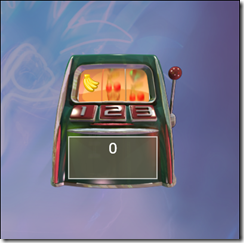

I entered the [European Silverlight Challenge](http://www.silverlightchallenge.eu/) with a Silverlight Slotmachine game and ended up halfway on the results list. I'm pretty happy with that result, giving that I only spent 3 full days on the solution. The graphics for the game was made by a friend of mine; Sigurd Kristiansen ([Simian](http://www.simian.no/)), for a project I worked on in 2001 at a company I co-founded with a couple of other guys; Hermes Interactive.

 

You can play the game and download the source code [here](http://www.dolittle.com/Silverlight/SlotMachine/SlotMachine.html).
