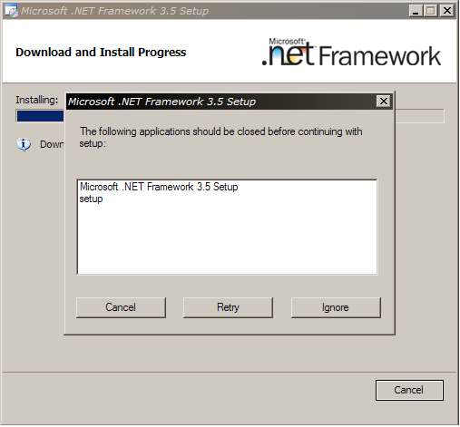

A friend of mine; Hans Petter Harveg, just emailed me an interesting error message they got when installing the .net 3.5 framework.

 

It must be the good old chicken and the egg story, I'm sure.. :)
