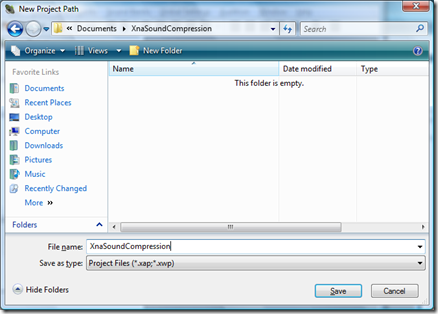
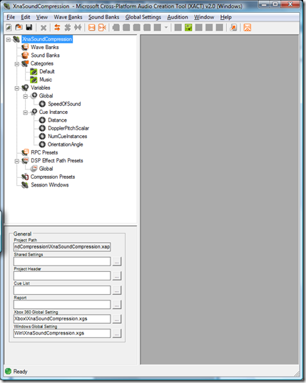
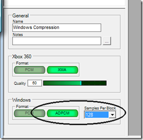
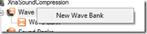
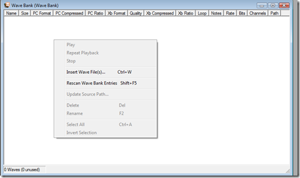
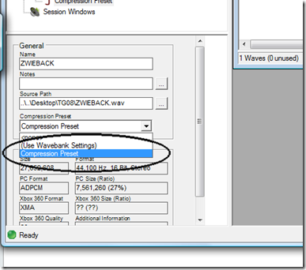
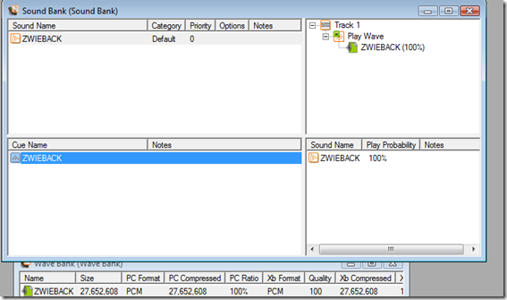

Xna does not support MP3 or WMA, neither on Xbox or Windows. For Xbox you have a format called XMA that is pretty much like WMA on Windows, but for Xna for Windows you have to resort to uncompressed (PCM) or close to uncompressed (ADPCM). This tutorial shows you how you can use ADPCM and get at least some compression for your sounds and save a bit of space. The average compression rate is 27% for the default settings.

We will be using XACT (Microsoft Cross-Platform Audio Creation Tool) that comes with both Xna 1.0 and 2.0.

Create a new project by going to File->New Project (Ctrl +N) and create yourself an empty project.

You then get a screen looking something like this:

First we will create a compression preset by right-clicking the compression presets and select new compression preset:

Give it a name, so you'll recognize it later on in the process.

Now we need to select ADPCM and samples per block:

We'll leave the samples per block to 128, which is default. The quality of the sound is quite good with this setting.

Now we need to create a wave bank by right-clicking the wave banks in the project and choose new wave bank:

Leave the default settings for now.

You're then given a window where all your wave files will exist for that particular wave bank. Here we can insert our wave files.  
Just right-click inside the window and choose to insert wave files:

Select your wave file:

We can now select the compression preset we want to use for the imported wave by selecting the wave file and then selecting the correct preset in the properties in the lower left of the application:

Now we need to create sound bank by right-clicking the sound banks and choose new sound bank:

Open your wave bank and select the wave file you want to be cue in the sound and drag it from the wave bank onto the cue part of the window.  
The result should be something like this:

You now have a project you can build and use from your solution programmatically.
