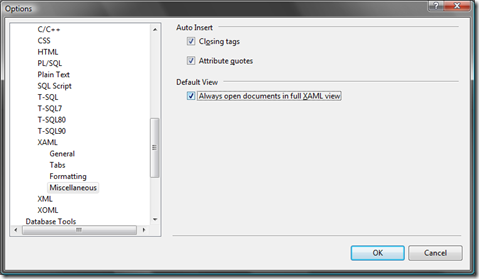

One of the things I've been finding annoying is the time the designer takes to load for an XAML file when opening it.  
Pressing escape stops it from doing all it's preparation for the designer and then maximizing it to XAML view helps, but that has to be done for every single file.

It is possible to set this behavior as default for the XAML designer. In Tools->Text Editor->XAML->Miscellaneous you'll find an option called "Always open documents in full XAML view":

