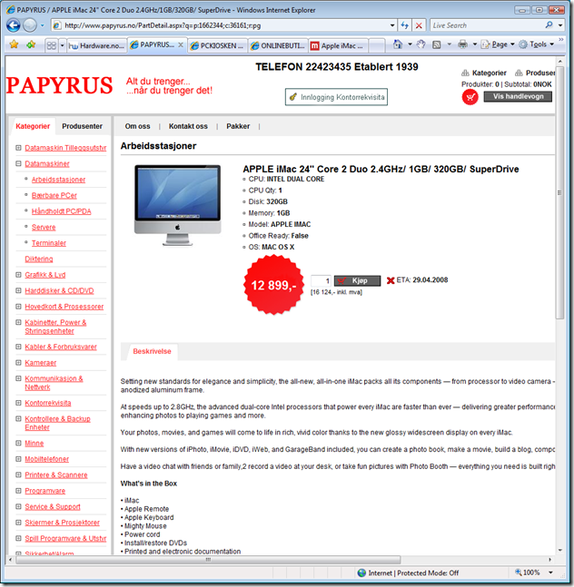
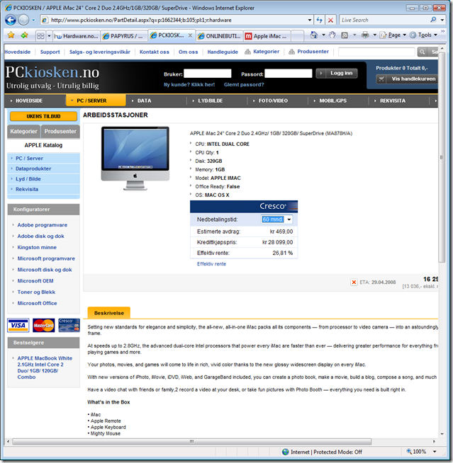
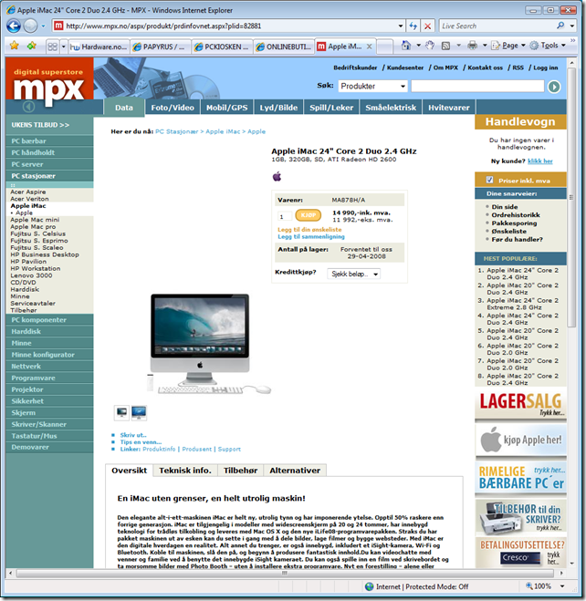

I've been considering buying a Mac for a couple of years now. Takes a while for me to decide. But lately I've had an image of an iMac on my eyelids whenever I close my eyes (makes it very hard to sleep), which has led me to subscribe to several Apple related feeds and really start to get to know the "other side". Anyhow, several sites has been expecting an iMac update before the summer hits and this week [reports](http://www.appleinsider.com/articles/08/04/25/new_imacs_in_retail_system_3g_iphone_redesign_rumor_3gs_d_day.html) started surfacing about an imminent release next week already.

The reports mostly looks for signs and base their rumors on these signs. One sign is that shops are running out of iMacs. I decided to look for these signs myself and visited a couple of Norwegian webshops that sell iMacs. Mysteriously they were all pretty much out of iMacs and had the delivery date set to the 29th of April 2008, which was the date that the rumors says a new version is coming out.

During my hunt for the perfect Mac for me, I joined a couple of forums and had a little idea in my head; what if I bought the cheapest 24" iMac and upgraded the CPU. The loyalty is incredible with Mac users, most of the response I got was on the lines of ".. you don't want to do that, it'll void your warranty.." , "... Apple has soldered the CPU to the motherboard ..." , "... it's to advanced opening an iMac ...".  As a PC user who's been opening up everything I've ever bought and putting together PCs from scratch, I found these statements strange.

Getting hold of the detailed specs about the computers from Apple has been a real hassle as well. After a lot of research, I managed to figure out what socket and chipset the iMacs was based upon. The same day I figured it all out, the rumors about a new iMac started surfacing. Back to scratch, waiting for the new ones to start thinking about buying one again. :)

Screenshots from WebShops and their ETAs:

