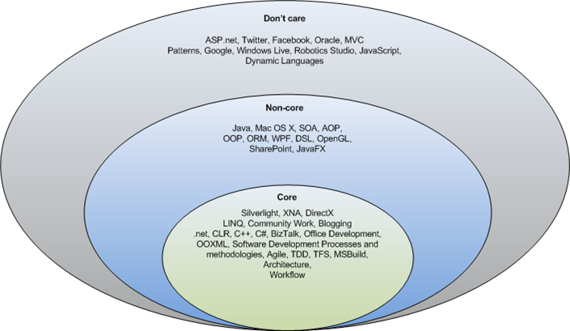

As a response to [Fredrik Kalseths](http://www.iridescence.no/) blog about [circle of interest](http://www.iridescence.no/Posts/Circle-of-Interest.aspx) and a subtle hint in his post that it would be interesting to see my circles (sounds a bit kinky, doesn't it), here goes :

It seems that I have a lot that I define as my core, but I think it reflects what I really care about. I could probably add a couple of more technologies in it, but I think it is more than sufficient. :)

Anywho, the background for all this is [Paul Stovells](http://www.paulstovell.com/blog/) post about [the circle of interest](http://www.paulstovell.com/blog/whats-your-circle-of-interest) (I know I called it circle of life, but then again computing pretty much consumes my life).

It was quite interesting doing this, you have to really stop and think things over. I challenge anyone reading this to do the same.
