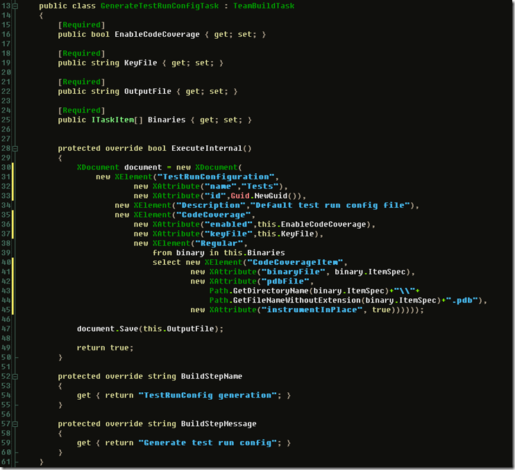

**\*\*\*\* <UPDATE Date="22nd of may 2008"> \*\*\*\***

**You have to add the namespace specification in front of every element.  
Create a XNamespace by doing :**

**XNamespace microsoftNamespace = [http://microsoft.com/schemas/VisualStudio/TeamTest/2006](http://microsoft.com/schemas/VisualStudio/TeamTest/2006);**

**Then for all the XElements do new XElement(microsoftNamespace + "<tagname>");**

**\*\*\*\* </UPDATE> \*\*\*\***

I've been working a bit with automating our build process and creating a lot of CI builds. Today I started getting our builds to run all the tests, create code coverage and then run static code analysis for it all. Getting the code coverage demands that the assemblies run during unit testing are all instrumented. Normally on the client side you just have a .testrunconfig file attached configured with all the assemblies. This same file could be used from the MSBuild running on the TFS as well as [Buck Hodges](http://blogs.msdn.com/buckh) [blogged about a while back](http://blogs.msdn.com/buckh/archive/2007/07/05/how-to-enable-code-coverage-without-a-test-list.aspx), but it would demand human interaction whenever assemblies were added or removed. I figured I had to come up with a remedy to this and created my own MSBuild task to handle it all.

The above code outputs the correct XML needed as input for the unit test run. So in your MSBuild file you need to use the same file for output through this task as the RunConfigFile property used bu the TFS TeamBuild.
