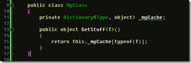
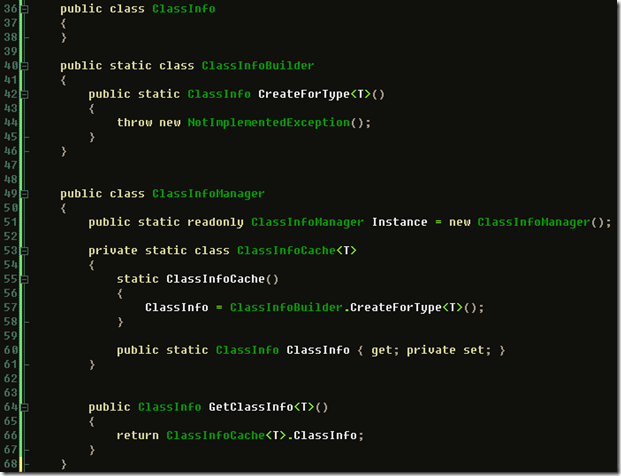

The runtime for .net has a type caching mechanism that is really great. Every so often I write code where you need specific data based upon a type. Normally one tend to revert to a Dictionary with Type as the key and the datatype as the valuetype for the generic parameters.

Typically:

This will then rely on he dictionary and its implementation. Sure, it is not a bad solution, but there is a more effective and last but not least; cooler way of going about achieving the same effect:

The beauty of this is that the static constructor will run once per type and one can do type specific stuff in the constructor

The two implementations above lack a lot, so lets go for a more complete sample:

