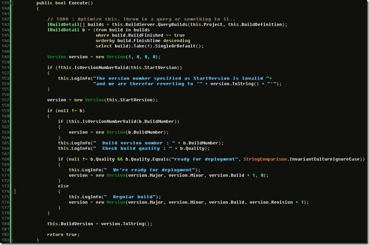
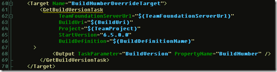

[Martin Woodward](http://www.woodwardweb.com) posted earlier about how to go about [aligning build numbers with assembly versions in TFS2008](http://www.woodwardweb.com/vsts/000417.html).

We used to do the same thing as he describes for our builds, but I found it really annoying having to have a file in the file system that the build task relied on and needed to be updated whenever one needed to delete the last build (oh yes, it happens - probably shouldn't - but it does.. :) )

The build task I came up with was a task that queried the buildserver for the builds and got the last build and retrieved the buildnumber and increased according to our build numbering strategy (We increase the revision (last number) by one for every build and the build number (the one ahead) by one for every hotfix). The task automatically handles all this by looking at the buildquality indicator that is used by testers (or at least should be used by them) to indicate the quality of the build. Our current scenario says that if it is marked with "Ready for deployment" it should increase the "hotfix" number.

I've attached the entire solution

[here](http://localhost:8080/wp-content/2012/07/TFSBuildTaskforgeneratingthebuildversion_BBD4_BuildVersion_1.rar)

, below you'll se a snapshot of the Execute() method, it relies on a couple of other methods  
and properties found in the class.

To use the task, simply override the BuildNumberOverrideTarget as follows:

