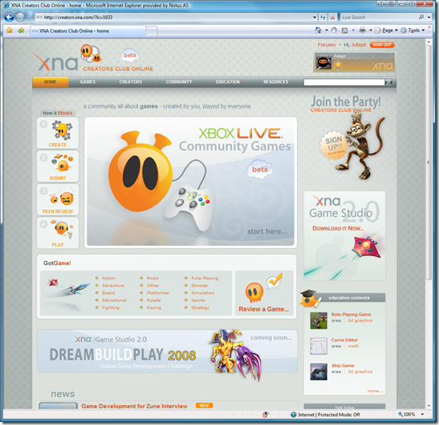

Yesterday, Microsoft launched a completely redesigned [creators club site](http://creators.xna.com) alongside with a beta of the community games.

Just entering the site after logging in, you can see how easy it is to submit a community game:

The site is intuitive to use and in my opinion has a great design. Keep up the good work guys!
