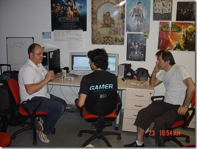

During my stay in Turkey I got invited to a games development company called Sobee. They have created a few titles that I found very very good. They’re now working on a massive multiplayer football championship game written entirely in C# utilizing managed DirectX. They have really proven that one can create trippel-A games using C# and the .net framework. We had a long and good talk about how Xna could help them leverage the Windows platform better and get even closer to porting their game to the Xbox 360 platform. The API difference between managed DirectX and Xna is not that big, most of the types are called the same or similar, some methods are different, and of course you’ve got the entire content pipeline in Xna that you haven’t got in MDX. But even with the content pipeline, the fileformats are all the same, so it should still be a fairly simple task to convert a MDX game and get it up and running on the Xna platform. Hopefully they’ll go for the Xna platform, as I think both their game would benefit from Xna and it would be a great case to show that Xna is really for professional games development as well as for hobbyists and casual gaming.

Below, you’ll see a picture at Sobee with me (from the left), Ozgur Soner and Mevlut Dinc discussing the possibilities.  
The funny part is that Mevlut Dinc I was told afterwards was one the guys behind a game on the commodore 64 called Last Ninja II ([http://www.mobygames.com/developer/sheet/view/developerId,68130/](http://www.mobygames.com/developer/sheet/view/developerId,68130/ "http://www.mobygames.com/developer/sheet/view/developerId,68130/")). So in many ways I had a meeting with one of the guys I had as my personal hero when I grew up and learned programming. Great fun! :) 

