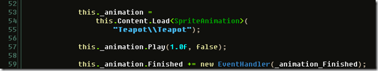

During my stay in Turkey for the Xna workshop I created a simple content importer that makes it easier to work with 2D animations. Very often you see people use spritesheets as the solution for animating 2D, which is of course not a bad way, it is a very optimal way to do things. I’ve always liked the simplicity of working with single frames, at least while I’m working on a solution, that way I can easily change stuff around. The content importer I created works with a simple Xml file (in fact just a serialized version of an object called SpriteAnimation), in this Xml file you can specify a base assetname as a format string, and you specify how many frames there are in the animation. The assetname must include the asset path as well.

The SpriteAnimation class is the one to use, it is also found in the content pipeline project, not exactly best practice. But it works for the demonstration purpose it was intended. :)

Using it is very simple:

In your draw method call the animations draw method with the spritebatch to draw into.

You can dowload the project from [here](http://localhost:8080/wp-content/2012/07/Simple2DAnimationContentPipeline_ContentPipeline.zip).
