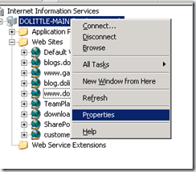
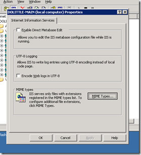
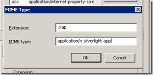

I’m still running Windows 2003 and IIS 6.0 on my server and needed to register XAP as a global MIME type for my server, seeing that I will be publishing a bit of Silverlight bits now and then. I’ve only come across IIS 7.0 guides for this, so I thought I’d share how to do this in IIS 6.0.

Open up IIS Manager (**mmc %systemroot%system32inetsrviis.msc**). Right click the computer name an select properties.

Click the MIME types:

Click new and type in the following:

Then you will probably need to reset IIS (run->iisreset or right click computer->All Tasks->Restart IIS).

Now you can deploy your Silverlight 2 XAP application to IIS 6.0.
