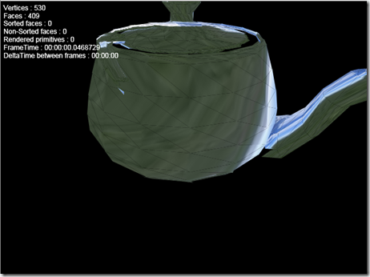

I’ve been quite busy the last week working on the [Balder](http://www.codeplex.com/Balder) engine. I’ve focused my energy on improving the rendering pipeline, both for functionality and speed and have managed to overhaul it quite a bit. In addition, texturemapping is becoming a fact. Thanks to [Whizzkid](http://whizzkid74.blogspot.com/2008/04/texturemapping-in-silverlight-20b.html) for pointing out problems that was in the Matrix class in version 1.1 that was now fixed and to this [article](http://www.codeproject.com/KB/silverlight/silverlight_triangle.aspx) by [Florian Kruesch](http://www.codeproject.com/script/Articles/MemberArticles.aspx?amid=3950651)

You can have a look at a very crude sample [here](http://www.dolittle.com/Silverlight/Balder_TextureMapping_Version1/TestPage.html) with a lot of bugs in it due to heavy refactoring. I’ve decreased the framerate of the sample by purpose, I’ll be working to improve the samples as well as improving the engine and its features the next couple of weeks. All sourcecode will as always be checked in and available at the [Balder Codeplex project](http://www.codeplex.com/Balder).

