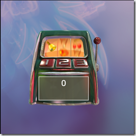

Finally managed to fix the 2D parts of the Balder engine and also the SlotMachine game I entered the European Silverlight Challenge with earlier. There are so many breaking changes between the versions of Silverlight that I see now that I need to rewrite quite a bit of my projects. You can find the game [here](http://www.dolittle.com/Silverlight/SlotMachine_Silverlight2_Beta2/SlotMachine.html).

