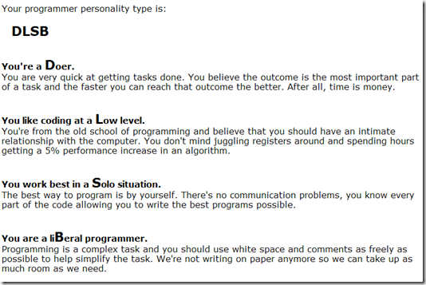

I'm always eager to know who actually reads my blog, whenever someone leaves me a comment I go straight to find out if the person has a blog. Stefaan Rillaert left me a comment and he had a [blog](http://stefaan.wordpress.com/) and his latest posting made me curious. It was a link to a test that apparently will reveal what kind of programmer you are.

I became the following.

You'll find the test [here](http://www.doolwind.com/index.php?page=11). And of-course we put our complete faith in these tests. :)  Actually, I think my result came out pretty good. It is at least how I see myself.
