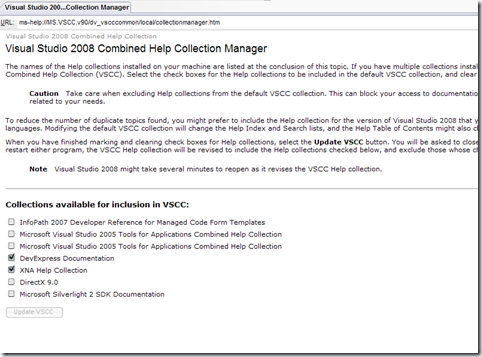

If you’re like me, you skip all readme files when installing something new and start hacking away instead. In most cases this works out fine, but every so often I would probably be better off just reading the readme or any other documents that came with the software I installed. Anyhow, this was also the case when I installed the latest Silverlight 2 Beta 2 SDK. There was a lot of broken changes between beta 1 and beta 2 and I wanted to update all my Silverlight projects and republish them on my blog, but ran into a couple of cases I’d like to read more about in the documentation, only to find out that the documentation was not where I expected it to be; in my MS-help, like all the other help collections I’ve got installed. Well, to make a long story short, here’s the recipe:

Open MS-help from VS2008 choosing Index. Type in Collection Manager :

Then select Help. You’ll get a nice page you can start selecting what collections to enable or not:

Select your collections, such as the Silverlight 2 SDK Documentation.
