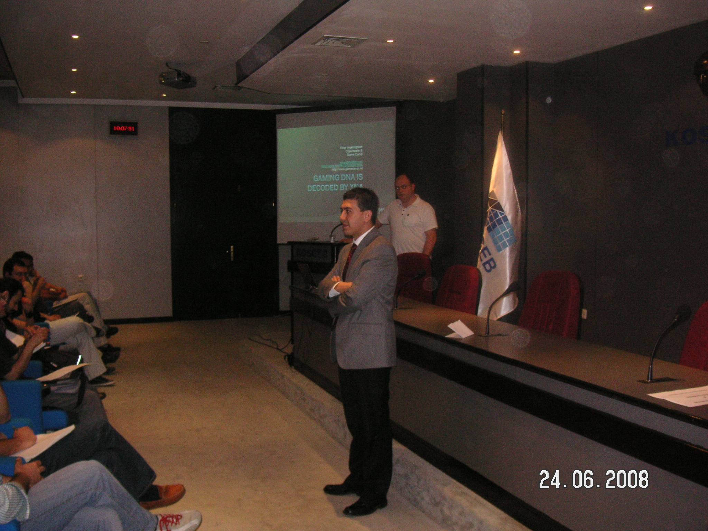
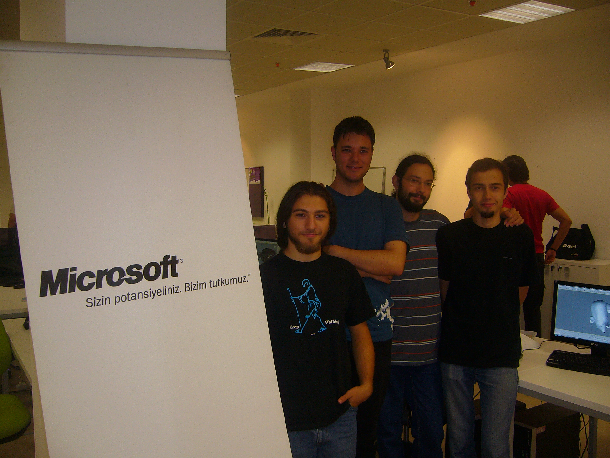
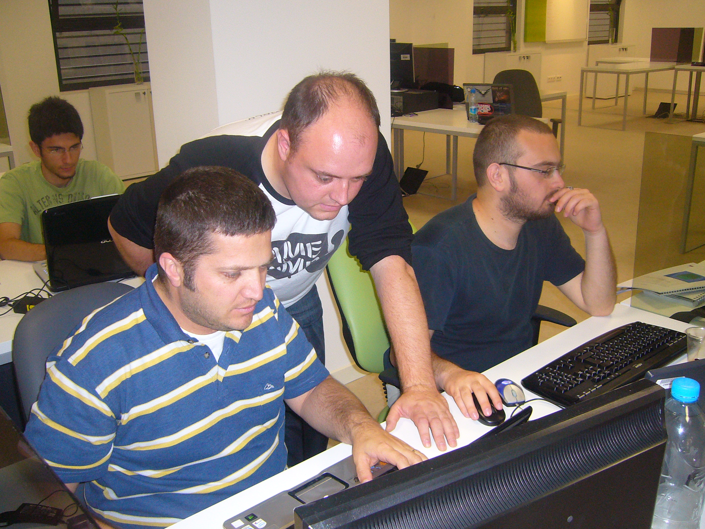

Here are some of the pictures from the workshop we held in Turkey. Click the images to see larger versions.

We started on Tuesday with a 2 hour presentation (30 minutes) and live coding (90 minutes).

Below you see all the people involved for the workshop; students, METU staff, Microsoft staff and myself. The students got diplomas for attending, signed by me. I even had to hand them out and called out their names in the best Turkish-dialect my vocal-cords could come up with. :)

We divided all the students into groups that would work together to create a game each. Below you see the winning team. All the students voted for which game they liked the best and we had a tie between two teams. The students wanted me to vote as well between the two and the result was the team below (sorry for the other team – your golf game with PhysX was great!! It was a tough call!).

Below you’ll see me assisting one of the developers on one of the teams; I’m trying to figure out a problem with a struct for a bullet system. The bullets didn’t want to move, for some strange reason…   We figured it out eventually, but couldn’t exactly tell what was wrong or not…

