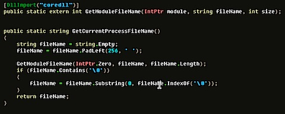

I´ve been working freelance on a Windows Mobile project for a client and for the project we wanted to have the application update itself over the internet and wanted the same experience one gets with ClickOnce on Windows and a simple API for any Mobile based application for handling updates and such.

In order for this to work I needed to have a seperate executable/entrypoint that was our update service running in the background handling all the gritty bits, this would then spawn the application. Because of a rather bad user experience having to start a different process than the one actually needed, I decided to have our update service installed with some registry entries to point out where it was installed and add an initialization method for our update service for the application to call. Anywho, long story short - I needed a way to figure out what process was running on the device and the filename of it to distinguish in which context the initialization was called.

Normally one would go about doing this by calling Assembly.GetEntryAssembly() - but the compact framewok does not have this method. Other ways are to go and call Assembly.GetCallingAssembly().GetModules()\[0\] and get the fully qualified name from there, but this didn´t work out in all conditions either. The solution is to p/invoke the GetModuleFileName() method from coredll - turns out it exists, even if the documentation does not list Windows Mobile in the supported platform section.. :)

  

[Mobile](http://technorati.com/tag/Mobile)
