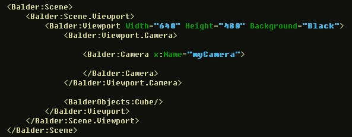
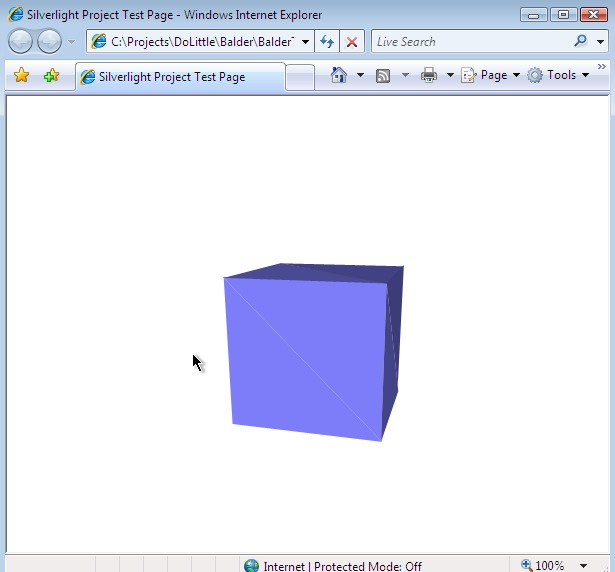

I've been working today with enabling declarative 3D through Xaml for the [Balder](http://www.codeplex.com/Balder) engine.  
You can now add the following to your Page:  
  
  
  
The above Xaml will result in the following:  
  
  
You can download the [source](http://www.codeplex.com/Balder/SourceControl/ListDownloadableCommits.aspx) and have a look at how it's implemented at this stage.
