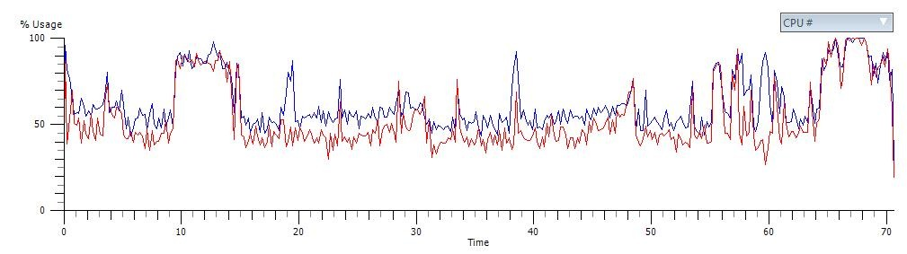

One of the things that I really missed the second [Jeff Wilcox](http://www.jeff.wilcox.name) released the UnitTest framework for Silverlight, was the ability to run it from within Visual Studio.  
The last couple of weeks, I've been working on and off a Silverlight UnitTest runner for ReSharper 4 at work (Objectware). And today, this morning, it paid off. A version 0.1 is ready for your pleasure (read disclaimer below) to download [here](/Downloads/SilverlightTestRunner.zip). I will after some tidying, release the source as an open source project.  
  
**How to install:**  
1\. Make sure Visual Studio is not running.  
  
2\. Create a directory called SilverlightUnitTest in the ReSharper plugins directory,  typically located at C:Program FilesJetBrainsReSharperv4.0BinPluginsSilverlightUnitTest.  
  
3\. Unzip the content of the ZIP file into the directory.  
  
4\. Add the assemblies (DLL files) to the Global Assembly Cache by opening the cache in Explorer (c:WindowsAssembly) and drag and drop the files into there.  
  
5\. Open Visual Studio and go to the ReSharper menu and select Plugins and make sure the Unit Test runner is enabled.  
  
6\. Write and run tests.   
  
  
**The future  
**There is a couple of things missing or is wrong in the current version, here is a short list of things I can think of. Please don't hesitate to leave me a comment with features or bugs (dispite the disclaimer below, I will try to handle them. :) )  
  
1\. Parts of a window that runs the tests pops up  
  
2\. It runs all the tests - need to implement a test provider for the test framework to only run the selected tests  
  
3\. Report back the stack trace and more information about tests that fail  
  
4\. Cleanup code. :)  
  
**Disclaimer:**  
myself nor Objectware will support this software in any way (hence the release to open source in the future), use it at your own risk!  
  
  

