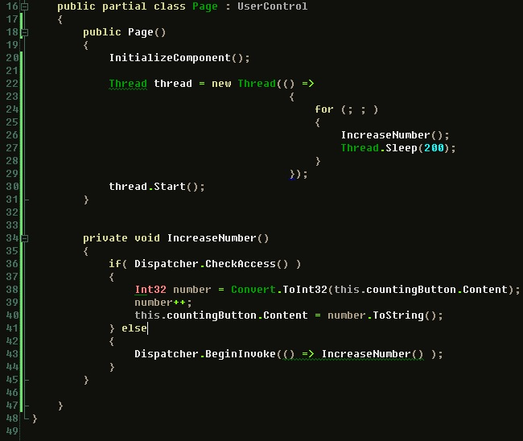

If you're a Windows forms developer you're probably used to using the Invoke() or BeginInvoke() to execute code in the context of the UI thread (Application loop). Same goes for WPF with the Dispatcher object.  
  
For Silverlight, this was also introduced in 2.0. The Dispatcher object is present in all UIElement objects and can be used to execute code in the context of the UI thread to avoid having cross thread exceptions. I've been needing this ever since I started working on the Balder 3D engine in order to get real performance from it. Now I can really get things flying.  
  
Here's a sample (Don't mind the squiglies from R#):  
  

