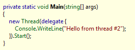
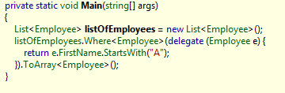
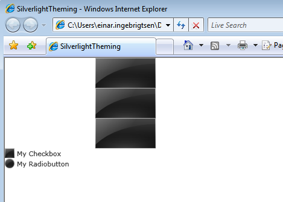
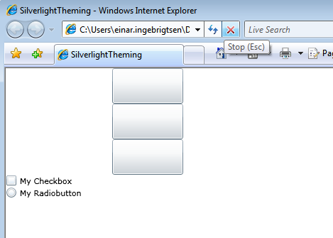

 **\*\*\* Update (2008-10-18): Added the solution as an attachment to this post + new title  
**

One of the things I really feel like is missing in Silverlight 2, is a theme manager with the ability to apply the same style or template to all controls of a specific targettype, or to all controls in your page / usercontrol based upon a resource file on your application. If you're creating UI it seems so wasteful to have to include Style="{StaticResrouce blahh}", not to mention the fact that we aren't able to dynamically change the Style easy during the lifetime of the application.  
  
I started today with creating the bits needed to do this, but quickly ran into a bit of a problem. All UIElements can have a resource dictionary attached to it with all the resources available for the context of that UIElement. So far so good. You can also use the XamlReader class to parse files with nothing but a ResourceDictionary in it. Then all we need to do, is to walk all the UIElements from the root visual you wish to apply for and set the Style property for these to the Style found in the ResourceDictionary according to the target-type specified. Problem is, the ResourceDictionary class does not implement the methods to just walk it, like for instance GetEnumerator().  
  
But by doing a couple of minor magical things (not really magic, but it sounds cool), we can get all the keys for all the styles and use the keys to index the dictionary. We then use this to create our own dictionary based upon Type being the key. It is then just a matter of recursively going through all UIElements from the root visual and setting the Style property.  
  
Heres the main method for getting the ResourceDictionary and parsing it:  
  
  
  
Then we need the "recursiveness":  
  
  
  
All you need then is to have a resource file with for instance the following markup as the start-tag:  
  
  
And put all your styles in here and close it all off with a /ResourceDictionary  
  
In your Page.xaml.cs file you just call the ApplyTheme with the RootVisual property on your page and the name of the file to use as a theme. The theme/resource file must be a content file:  
  
  
  
In your Page.xaml for instance, you can then go about creating your UI without thinking about the styles.  
  
  
The result will be something like this (Using [Dave Crawfords Glossy theme](http://timheuer.com/blog/archive/2008/10/06/silverlight-control-template-gallery-styles.aspx)):  
  
  
Without the "theme" applied, it looks like this:  
  
  
  
This technique can also be applied if you want to apply templates to your controls.  
  
  
You can download the working solution from below:

[SilverlightTheming.zip (36.69 kb)](http://localhost:8080/wp-content/2008/10/SilverlightTheming.zip)
