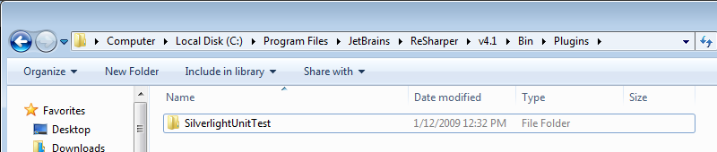
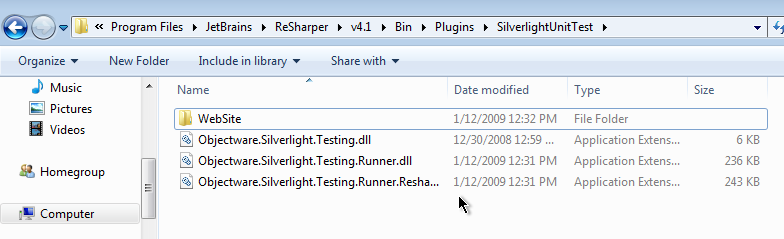
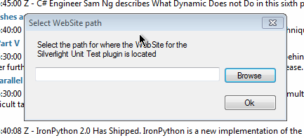
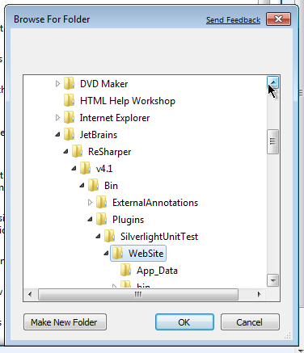
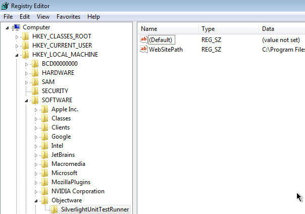
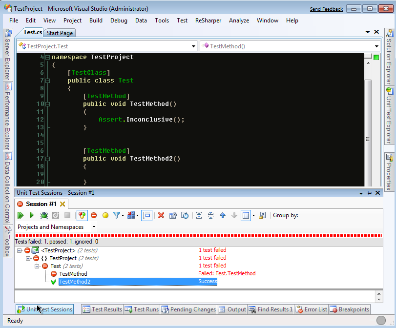
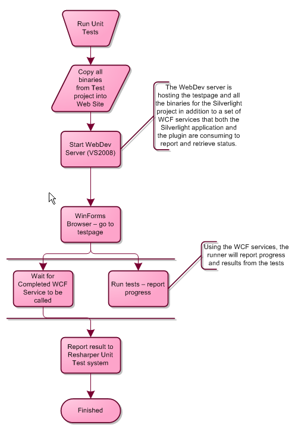

**UPDATE, 6th of May 2009: Project has been rewritten and put into another project, read more [here](/post/2009/05/01/Silverlight-Unit-Test-runners-new-project-3e-Odin.aspx).**

I got some sparetime between all the family dinners during the christmas holidays and pretty much did a total rewrite of the Silverlight Unit Test Runner for Resharper.  
  
The reason I had to go pretty drastic measures, was that the first version was closer to a proof of concept than production quality, and it also had a few flaws in it with regards to reporting results and also taking in input to the Silverlight part of the runner.  
  
Anyways, the new and improved version can be downloaded [here](/Downloads/SilverlightUnitTest_January2009.zip).  
  
To install it, you need to have a Plugin folder in the Resharper bin directory, and within this a folder for the plugin, e.g. SlverlightUnitTest :  
  
  
Once you have this in place, you need to unzip the file above. You'll now have a folder looking something like this:  
  
The three DLLs you see in the folder need to go into the Global Assembly Cache. Simply open explorer and browse to c:WindowsAssembly and drag these files into this folder (do not move them, just normal drag'n'drop).  
  
As you can see, there is also a WebSite folder inside the plugins directory. This is the website that everything is running in. The path for this will come handy when the plugin is first initialized. If it is the first time running the plugin after this upgrade, you'll get a dialog asking for the path for the WebSite for the Silverlight Unit Test Runner. The path of the WebSite above is the one it needs.  
  
  
Simply click browse and select the path:  
  
  
If by any chance you select a wrong path, or want to change the path, you can simply go to the registry and fix it by either removing the value or changing it yourself:  
  
  
You should now be able to run your Silverlight Tests like any other test you've been running through the Resharper Unit Test Explorer.  
  
  
**Whats new  
**The entire architecture of the plugin has changed. The previous version relied on an Xml being outputed from the Silverlight application running into the enclosing HTML DOM. This is now changed to be using WCF services.  
It will now run only the tests you have selected to run. These are sent as parameters into the plugin and forwarded to the Unit Test framework by Jeff Wilcox as tags.  
  
**How does it work  
**Instead of half-way trying to explain how it all works, a picture speaks more than a thousand words they say:  

