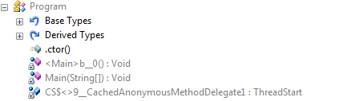
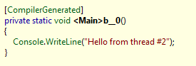
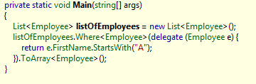

I've been blogging [previously](/post/2008/11/03/Compiler-extensions-is-just-another-framework.aspx) about how compiler extensions could solve a bunch of issues and how compiler extensions would just represent just another framework.  
  
The reactions to the concept are mixed. Mostly it raises a lot of feelings to the surface. We as developers are really truely attached to our favourite programming language, and we also tend to be really loyal as well. That said and lets get to the point; when we're looking at the evolution of C# for instance, the path Microsoft has taken surely looks a lot like they are writing compiler extensions to solve the issues they want solved.  
  
Anonymous delegates for instance, they are nothing but compiler magic.  
Take the following sample:  
```csharp  
ThreadStart threadStart = new ThreadStart(  
      delegate()  
            {  
                  Console.WriteLine("Hello from thread #2");  
            }));  
Thread thread = new Thread(threadStart);  
thread.Start()  
```  
  
If we open the compiled binary in a program like Reflector and take look at what the compiler has actually done:  
  
  
  
The compiler generates a method called <Main>b\_0() that has the content of the anonymous delegate:  
  
If we set the optimization option i reflector to .net 1.0, we can see the content of the Main() method and what it is actually doing:  
  
```csharp  
private static void Main(string\[\] args)  
{  
    ThreadStart threadStart = (CS$<>9\_\_CachedAnonymousMethodDelegate1 != null) ? CS$<>9\_\_CachedAnonymousMethodDelegate1 : (CS$<>9\_\_CachedAnonymousMethodDelegate1 = new ThreadStart(Program.<Main>b\_\_0));  
    new Thread(threadStart).Start();  
}  
   
```  
  
  
This is just one of many "compiler extensions" Microsoft has up their sleeve themselves. With C# 3.0, Microsoft introduced quite a bit of new language constructs. var, extension methods, Lambda, LINQ, anonymous methods - to name a few. All these features are built upon the .net 2.0 CLR and does not introduce anything new to the runtime, which means that they are all just compile-time magic.  
  
Taking the above sample and making it more C# 3.0:  
```csharp  
var thread = new Thread(  
      () => Console.WriteLine("Hello from thread #2"));  
thread.Start();  
```  
  
We take use of the var keyword and lambdas and the code looks a lot better. But opening this in Reflector, targetting CLR 2.0, you'll see what really goes on:  
  
  
  
The var keyword is replaced with the actual type, as expected and the lambda expression is expanded to a delegate as expected.  
  
LINQ takes the rewrite to the extreme, consider the following C# 3.0 code:  
  
```csharp  
var employees = new List<Employee>();  
  
var query = from e in employees  
                  where e.FirstName.StartsWith("A")  
                  select e;  
  
query.ToArray();  
```  
  
The expanded version looks like this:  
  
It expands the LINQ into using the fluent interfaces defined for LINQ.  
  
  
So, where am I going with this. You probably already knew all this. Well, my point is; if Microsoft themselves are pretty much doing compiler extensions today, I do not see why we shouldn't. It is not as scary as one would first think. Compiler extensions could solve a bunch of domain specific problems one is facing and if one did the extensibility correctly, all extensions written would act as just another framework.
