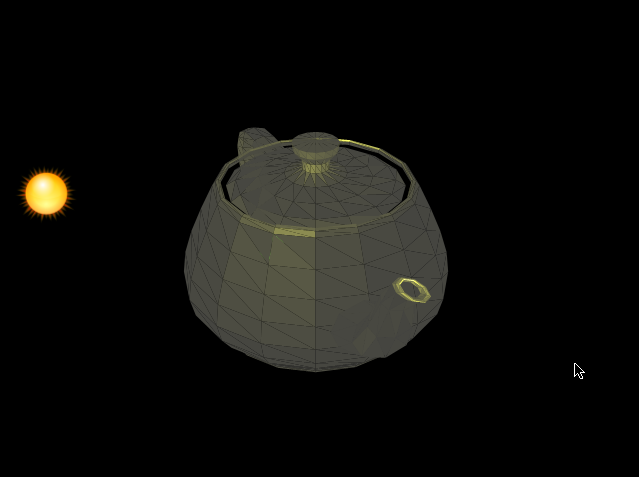

**UPDATE: 5th of May 2009, software rendering, read more [here](/post/2009/05/05/Software-rendering-in-Balder.aspx).**

Its been a while since I've had the time to actually post new posts on my blog, there is a reason for that. I've been busy as a bee. I have 4 OpenSource projects I'm working on, besides having a fulltime job and having a family with 2 small children. So, blogging hasn't been on the top of my priority list.  
  
Anyways, during the easter holiday I got a lot of time on my hands to start working on the Balder project again.  
  
I ended up totally refactoring the entire engine, and during the process also started implementing some unit tests.  
The result of the refactoring, or should I say rewrite (since the API has changed dramatically) - is that I've had a speed boost that is very dramatic. I haven't gotten around to do a complete comparison of the previous code and the new, but just firing up a 3D model, you'll be able to see it with your naked eyes.  
  
During the rewrite, I made the engine open for any target - meaning that it is now possible to target other targets than Silverlight if you'd like, introducing an abstraction for all device specifics. We are talking about creating an XNA version and a OpenGL version for running on Mono. Also, [Petri Wilhelmsen](http://digierr.spaces.live.com/), has joined the team and will start hacking away on the code very soon.  
  
For now, I've had to remove a couple of the features that was in the first version, such as Texture mapping, this will resurface very very soon again. Our focus now is to create the material system.  
  
Also, tutorials and samples are something we're looking into creating more of. With the new API it is really simple to get started, so look out for that as well.  
  
The entire project can be found at [CodePlex](http://www.codeplex.com/Balder).  
  
A demo can be found [here](http://localhost:8080/silverlight/Balder/20090423/TestPage.html).  
  
.  
  
  

