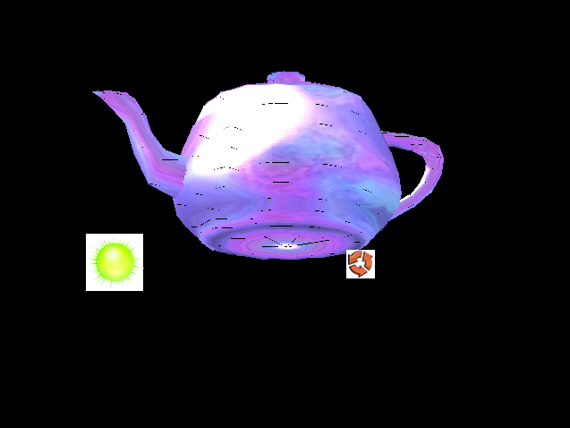

**UPDATE, July 5th 2009: read about Silverlight 3 optimizations [here](/post/2009/06/22/Balder-Silverlight-3-2b2b.aspx) and the alpha release [here](/post/2009/06/27/Balder-reaches-alpha-release.aspx).** 

Ever since I started the Balder project back in 2007, the main goal has always been to get proper texturemapping support in the engine. At one point I had it all up and running by utilizing the Silverlight Matrix transformations for the brush used to make it scale and skew according to the given texture coordinates.

The problem was speed. I never really figured out what the speed issue was, but I guess the architecture of Silverlight was never built with 3D graphics in mind. 

With the new [software rendering technique](/post/2009/05/05/Software-rendering-in-Balder.aspx) in place, it is a lot easier to get different drawing techniques up and running. One drawback we ran into when doing everything with "software", we can't utilize the imaging support, such as the PNG decoder that Silverlight has built in, there is no way to get hold of the pixel data. So, the first thing we needed is to have a C# decoder og image data and we started off with PNG. Looking for an existing PNG decoder entirely written in managed code (C# preferably) turned out to be quite an interesting task. After some time googling, I finally came across a project called [PR2](http://sourceforge.net/projects/pr2/) that has something called SharpPNG. After bending the code a bit, I got it running in a more generic way and put it in the Balder repository (with all credits intact - ofcourse).

After getting the image loading in place, it was off to write the texturemapping support. With the generic implementation we have for doing triangle drawings at the moment, the task ended up being quite simple.  
A snippet from the SimpleSpanRenderer as an illustration:

\[code:c#\]  
        public void Texture(IBuffers buffer, Span span, Image image, ImageContext texture)  
        {  
            var spreadCount = span.XEnd - span.XStart;  
            TextureInterpolator.SetPoint(0, span.ZStart, span.ZEnd);  
            TextureInterpolator.SetPoint(1, span.UStart, span.UEnd);  
            TextureInterpolator.SetPoint(2, span.VStart, span.VEnd);  
            var yOffset = span.Y \* buffer.Display.Stride;  
            var rOffset = buffer.Display.RedPosition;  
            var gOffset = buffer.Display.GreenPosition;  
            var bOffset = buffer.Display.BluePosition;  
            var aOffset = buffer.Display.AlphaPosition;  
            var bufferOffset = yOffset + (span.XStart \* 4);  
            var depthBufferOffset = (buffer.Width \* span.Y) + span.XStart;  
            TextureInterpolator.Interpolate(spreadCount);  
             
            for (var index = 0; index < spreadCount; index++)  
            {  
                var z = TextureInterpolator.Points\[0\].InterpolatedValues\[index\];  
                var bufferZ = (UInt32)(z \* (float)UInt32.MaxValue);  
  
  
                var u = TextureInterpolator.Points\[1\].InterpolatedValues\[index\];  
                var v = TextureInterpolator.Points\[2\].InterpolatedValues\[index\];  
  
                var intu = (int)(u\*image.Width)&(image.Width-1);  
                var intv = (int)(v\*image.Height)&(image.Height-1);  
  
                var texel = ((intv\*image.Width) + intu)\*4;  
  
  
                if (bufferZ < buffer.Depth\[depthBufferOffset\] &&  
                    z >= 0f &&  
                    z < 1f  
                    )  
                {  
                    buffer.Display\[bufferOffset + rOffset\] = texture.Bytes\[texel + 1\];  
                    buffer.Display\[bufferOffset + gOffset\] = texture.Bytes\[texel + 2\];  
                    buffer.Display\[bufferOffset + bOffset\] = texture.Bytes\[texel\];  
                    buffer.Display\[bufferOffset + aOffset\] = texture.Bytes\[texel + 3\];  
  
                    buffer.Depth\[depthBufferOffset\] = bufferZ;  
                }  
  
                bufferOffset += 4;  
                depthBufferOffset++;  
            }  
        }  
\[/code\]

Finally we had to add support for materials in the ASE file loader, I ended up spending too much time trying to figure out a good way to do it with regular expression, ending up with also adding a project by [Joshua Flanagan](http://flimflan.com/blog/default.aspx) called [Readable Regular Expressions](http://flimflan.com/blog/ReadableRegularExpressions.aspx) in combination with [LINQ to RegEx](http://weblogs.asp.net/rosherove/archive/2008/05/06/introducing-linq-to-regex.aspx) by [Roy Osherove.](http://weblogs.asp.net/rosherove/) Both projects are now part of the Balder repository as well. The reason for adding them to the repository is for maintenance purposes, seeing that we're targeting Balder for multiple platforms. The better way would probably be to contribute to the projects so they had the modifications or support we need to have for Balder. 

With all this in place, it was texturemania going on:

  

There is also experimental code in the Balder repository for doing spherical environment mapping. This will be part of the material system, so one does not have to think about it in the code.

  

You can see both demos in realtime [here](http://localhost:8080/silverlight/Balder/20090519/TestPage.html) and [here](http://localhost:8080/silverlight/Balder/20090519_EnvMap/TestPage.html).
