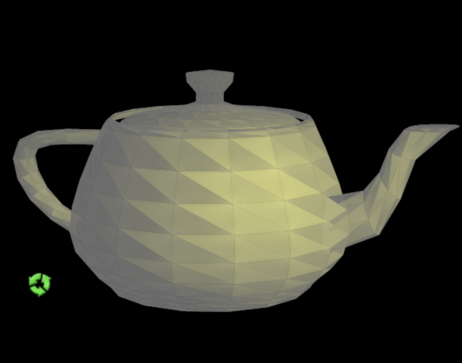
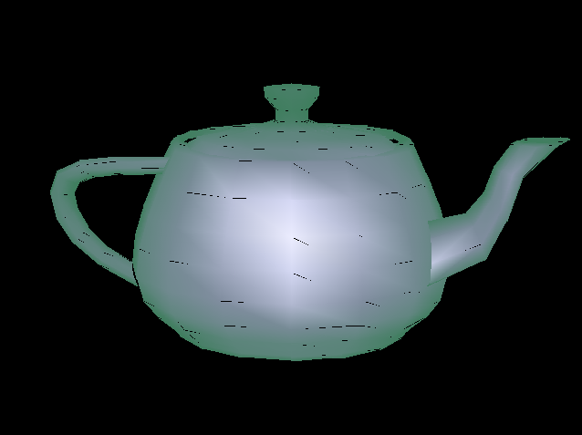

**UPDATE: 19th of may 2009 - Texture support is now added, read more [here](/post/2009/05/19/Balder-gets-its-long-awaited-texture-support.aspx).**

We've been hard at work the last couple of weeks to bring Balder to a point where it can be useful, not only a proof of concept for prooving that 3D can be done in Silverlight.

Our main challenge is to get a proper framerate in Silverlight. The reason for this is due to the architecture of Silverlight, there is a big cost in marshalling data between the CLR and the rendering/Xaml engine, so one has to try to limit this. Our initial plan was to generate all the polygon data needed in a 3D scene during initialization and then just turn the visibility on and off and modify the coordinates and color/brush information dynamically. Since a polygon is a dependency object and the properties we needed to modify was dependency properties, this sounded like a good plan, and it was. My [previous post](/post/2009/04/23/Revitalizing-Balder.aspx) showed a version using this technique, and we could get a decent framerate, but it was only flat shaded - no shading nor texturemapping.

Our next goal was then to include what is known as gouraud shading, here we ran in to a bunch of issues. First of all, how could one simulate the effect of gouraud shading in Silverlight 2, when there is no brush that has this implemented. The brushes available in Silverlight are SolidBrush, LinearGradientBrush and RadialGradientBrush. After some experiments, I ended up getting a solution working using the RadialGradientBrush. The technique I used was to have 3 polygons representing every triangle, all with different radial brushes. The brushes hotspot/origin was then set to be on the 3 points representing the triangle and then have some magical calculation for generating the correct color values and alpha values for the gradients. The result was kinda nice, allthough not entirely correct rendering.

I then started to implement it for the engine itself, but never finished it, the result before finishing it was this:

The reason for not finishing it was plain and simply speed. The FPS dropped from a solid 30 FPS to 5. We decided then that in order for this project to survive, we needed to do something dramatic. I started then to look at how we could draw using "software" - pixeldrawing in C#. In Silverlight 3, this would be a walk in the park, seeing that there is an ImageSource called WritableBitmap, in Silverlight 2, which is still our main goal, it is not all that straight forward to do. I remembered that I had seen samples of water effects, mandelbrot and such for Silverlight 2, and the technique being used is to generate a RAW PNG file on the fly every frame and streaming this into the BitmapImage source. [Joe Stegman](http://blogs.msdn.com/jstegman/) has an excellent implementation for this [here](http://blogs.msdn.com/jstegman/archive/2008/04/21/dynamic-image-generation-in-silverlight.aspx). But, being in a optimization mode, I found there was a couple of things in his solution that generated quite a bit of overhead.

First of all, there is an EditableImage class holding the buffer one can draw to, this is then encoded into a new buffer. Another thing I found to be an overhead, was the usage of two different memorystreams during the encoding. Long story short, during the weekend I decided to create what I called a RawPngStream. It is a somewhat highly optimized stream that holds a buffer one can write to. The listing of the source is to big for this post, and to much details to go into - but you'll find it over at [CodePlex](http://www.codeplex.com/Balder) in the [Balder.Silverlight project](http://balder.codeplex.com/SourceControl/changeset/view/33679#412801).

What we have done now is to introduce a general software rendering component, that is not targetting specifically Silverlight - in fact, we created it for Windows Forms first - seeing that it was easier to get things up and running there first. The last thing we've done is to implement the Silverlight specifics, with the framebuffer handling and all. The result, with a few inaccuracies in the polygon routine for now, is as follows.

A demo can be found [here](http://localhost:8080/silverlight/Balder/20090505/TestPage.html).

  

