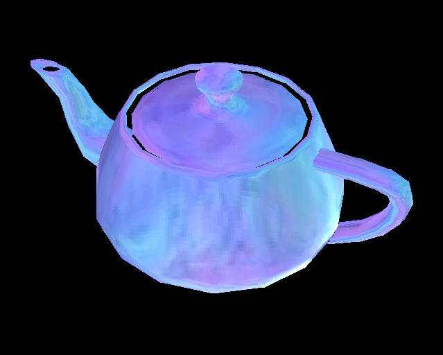

**UPDATE, 12th of February 2010, Balder 0.8.8.6 is out, take a look at the sample browser [here](http://localhost:8080/silverlight/Balder/20100208/TestPage.html) - read more about the new features [here](/post/2010/02/08/Balder-0886-is-out.aspx).**

We've been hard at work on Balder lately, with getting Silverlight 3 support up and running, optimizations and bugfixes.

Uptil this last week, we were focused on getting the most juice out of Silverlight2 before thinking about Silverlight 3, meaning a lot of work on the PNG streaming feature to get it just right and exploit multithreading to achieve parallelism in the pipeline. The result was a framerate boost that gave the test scene we're running a pretty steady 35 FPS. With the introduction of Silverlight 3 and its WriteableBitmap, things are looking up quite a bit for getting quite acceptable framerates. Only problem we've got now, is that the scale has tipped a bit. With SL2 we had to focus on the last part of the rendering pipeline, namely getting the pixels to the plugin from the managed buffers. With SL3 and the speed we're seeing with the usage og WriteableBitmap, we need to go back and optimize other parts of the rendering pipeline to get the framerates we want. 

The current rendering technique has a lot to be desired as for optimizations, it was "thrown" together more as a proof of concept, we're now hard at work with a new technique that will enable us to really not draw more than we need to and be able to run more complex scenes.

Silverlight 3 samples:

Only shading:

Environment mapped:

You'll find the samples [here](http://localhost:8080/silverlight/Balder/20090622/TestPage.html) and [here](http://localhost:8080/silverlight/Balder/20090622_EnvMap/TestPage.html)
