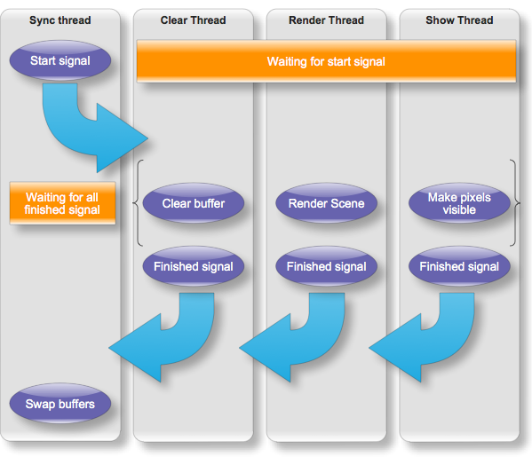
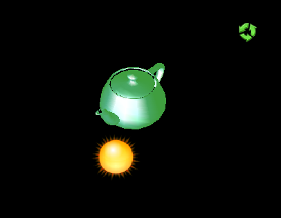

Working with Balder really gets me nostalgic. Nowadays, working with graphics programming one would choose OpenGL, DirectX or Xna to get real performant. Back in the days (mid 1990s), we didn't have the luxury of high-speed CPUs and dedicated 3D accelerated graphics adapters. Everything had to be done by the CPU. Balder has turned out to be just that kind of project, everything is done by the CLR and then the CPU.

Balder is now closing in on the beta stage, which means that we're getting close to the featureset we want to have for version 1 of the engine. While completing the features for the engine, we're also dabbling a little bit with optimizations. The true optimizations will happen in the final stages between beta and release, but its natural while working with features to increase performance on some parts of the engine. We've only scratched the surface of what is possible to optimize, the potential is great.

The first optimization we did was a couple of weeks ago, when getting Balder ready for Silverlight 3. Silverlight 3 introduces something called WriteableBitmap which gives access to a pixel buffer that can be manipulated pixel by pixel. After seeing the results from René Schultes [speed tests,](http://kodierer.blogspot.com/2009/07/silverlight-3-writeablebitmap.html) its obvious that WriteableBitmap is the right choice for the job, allthough I put quite a bit of work into the Png streamer.

Over the course of this weekend, I managed to get quite a bit of work done - focusing on optimizations. One of the focus areas we've been having is to get things running in parallel. Silverlight has great threading capabilities and are able to utilize multiple CPU cores very efficiently. In the release version of Silverlight 3, Microsoft has allowed for cross thread access to the pixels in a WriteableBitmap. This is good news for us. The previous version, the 0.8 alpha version, had one thread doing all the job. This was not exploiting the posibilities, and left the CPU pretty much doing nothing half the time. The new solution has 3 buffers and 4 threads, one thread for syncronizing all the work being done and one for each of the buffers. The buffers has special purpose; one for clearing, one for rendering and one for showing - showing being the copying of pixeldata to a WriteableBitmap. 

The flow is as follows: 

  
In addition to this, the rendering is no longer working on bytes for every color component, but writes an entire 32 bit int to the buffer for every pixel. These optimizations has truely paid off, on my computer with the regular teapot test (about 1000 polys), gives a framerate between 50 and 60. This is promising, considering we've hardly started optimizing at all.

A demo can be found [here](http://localhost:8080/wp-content/2009/07/TestPage.html). It should look something like this:

