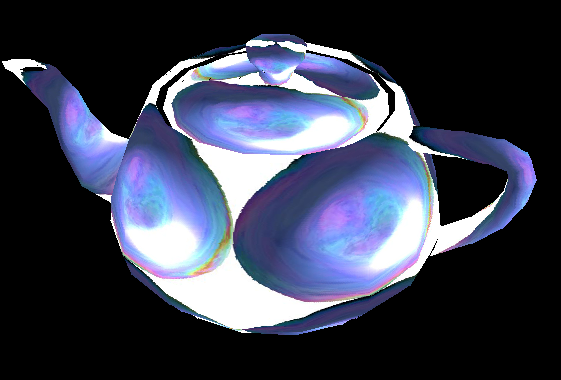

Balder has been updated to support Silverlight 3 the release version.

The previous samples posted [here](/post/2009/06/22/Balder-Silverlight-3-2b2b.aspx) now works with the release version.  
You can find the samples directly [here](http://localhost:8080/silverlight/Balder/20090622/TestPage.html) and [here](http://localhost:8080/silverlight/Balder/20090622_EnvMap/TestPage.html). And I've also created a version that just shows off that the texturemapping is very real, it can be found [here](http://localhost:8080/silverlight/Balder/20090622_TextureMap/TestPage.html). :)

We're working on new demos to truely show off Balder - its feature richness and capabilities are way beyond a rotating teapot. But focus on getting everything right in the engine has taken away energy to create a proper demo. Fear not, it will come. Stay tuned.

