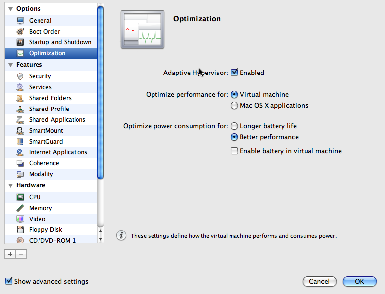

I've been a Mac owner for about a year now - it takes some time getting used to coming from a hard-core Windows mindset. My goal, entering this new stage, was to suck in all the experience possible from the platform and use Windows as little as possible, but being a .net developer, Mono and MonoDevelop does not quite cut it - so Visual Studio is needed to do proper .net development. With my first Mac I had a Boot Camp partition with Windows installed and used Parallels to access the same installation as well. This opened up a can of trouble when going back and forth between Boot Camp and Parallels because of drivers and such, not to mention Parallels services installed. After a while I figured it was probably better to have a dedicated virtual machine existing in a virtual image. 

Several months later, I'm finally content with the speed of my installation. Here are my findings so far.

**Stripped down Windows**  
If you're like me, not using Windows for much - in my case I have basically 3 things installed; Visual Studio, SQL Server and SQL Server Management studio, you are probably better off having a stripped down Windows. This can be achieved in many ways. One way is to take a standard Windows installation and start disabling services and removing Windows features. Another way is to get something called TinyXP. TinyXP is a distribution, not from Microsoft, that has most features removed. There is a boot meny were you can chose what you want installed, and the bare minimum does not include internet explorer, mediaplayer or outlook express. Most "nice to have" services are disabled as well. You can also chose to install it without any driverpacks, to keep the size down. For a virtual machine were the hardware is constant, this is probably the best option. TinyXP as mentioned, does not come from Microsoft, so using it is most likely a violation of the license. Instead of using TinyXP, one can use a tool called [nLite](http://www.nliteos.com/) or [vLite](http://www.vlite.net/) if you prefer Vista. The tool allows you to take your existing XP or Vista install CD/DVD and select what features you want to include. When you're done, the tool will create a new installation CD/DVD for you.

I prefer running Windows XP, as it has the basic featureset I need and Visual Studio and all versions of .net runs on it. 

**SCSI vs IDE**  
As with all VM software, Parallels also comes with an option of running the harddrive on an emulated IDE or SCSI bus, the default being IDE as this is more compatible and Windows has default drivers for handling this. My experience so far, is that running on SCSI gives a lot better performance, especially using Visual Studio. It doesn't matter what kind of physical disk you're having, you can still use SCSI even if your physical drive is IDE. For Windows XP you can't simply switch to SCSI by default. Windows XP detects the SCSI adapter to be a BusLogic one, and this one will crash during boot. So, the trick would be for instance to set your CDROM to be SCSI and leave your primary harddrive as IDE and then boot into Windows and go to the device manager and install the SCSI driver which is most likely marked with a question mark stating an error with it. The drivers are located on a floppy image located in /Library/Parallels/Tools/drivers.fdd - mount this in Parallels and install the drivers from the mounted floppy inside Windows XP.

**Parallels options - Optimization**  
In Parallels 4, there was great improvement to handling OSX caching. By default, OSX will enforce caching for any files used, meaning that your virtual harddrives could potentially eat up a lot of your memory when in use. On the optimization page, you should leave the "optimizate performance for" option on Virtual Machine, and I prefer to use the Adaptive Hypervisor. What this means, is that it will change focus between OSX and your Virtual Machine for utilizing the CPU and other resources. Also worth mentioning is to set the Better Perfomance option and untick the "Enable battery in virtual machine", that ensures full speed-ahead - allthough draining your battery.

  

**Shared Resources**  
In Parallels there are several producitivity such as shared folders, shared user profile, shared applications, smart mount and such. My experience is that enabling Shared Profile and Shared Applications lags things a bit, so keeping these off will boost performance a bit.

**CPU**  
Parallels has the option of virtualization your diffferent cores, you can select how many cores you want to use for your virtual machine. I go with the number of cores I have (which is 2 on my Macbook Pro), there is quite a performance boost by doing so.

**3D Acceleration + viewmode**  
One of the neat features of Parallels introduced in Parallels 3 was the ability to support 3D acceleration. This is really nice if you're using any 3D software or playing games, but for doing software development this does not make any sense. In fact, it seems to slow down regular graphics a bit and if you're using software such as Blend or Visual Studio 2010 that relies on WPF (Windows Presentation Foundation), it seems to be even slower. My tip is to leave this off and just allocate enough memory to cope with your screen resolution, typically 16MB should be enough.

Another thing that Parallels comes with is the ability to run in what is called a coherence viewmode. This makes your Windows applications appear as if they are a part of the OSX desktop and they float around like any other OSX window. This is great if you're in a multi monitor environment and want to keep some of your Windows windows on seperate monitors. But, there is a downside, performance wize. I prefer running in fullscreen, even if I run on a multi-monitor setup.

**Sound, USB**  
Since my Virtual Machines are primarily there to host Visual Studio, I have chosen to disable both sound and USB. Parallels supports virtualization of USB, meaning that the entire USB hub is available within the Virtual Machine and anything connected to any USB port can potentially be connected directly in the Virtual Machine. If you don't really need these, this is another performance boost.

**Swap files**  
This tip is more of a best practice regardless if you're running in a virtual machine or not; have a seperate partition or drive for your swap file(s). In Parallels I've chosen to have a seperate harddisk. This boosts performance quite a bit.

**Fixed size disks**  
By default Parallels creates growing disks, this is quite a bit slower than a fixed size disk. Since I have several virtual machines, I create my images with a fixed size and set them to the bare minimum, typically 8 or 10 GB and all my data is on a seperate virtual harddrive that all virtual machines share. 

**Windows Services**  
Even if I run on a stripped down Windows, some services are still left on after installation. Manually turning these off will increase performance of the Windows installation and use less memory, some of the services you might find running and might not need are:

\* Image acquisition - typically used for scanners and such  
\* Printing - I don't print from Windows, in fact I never print at all - environmental awareness  
\* Firewall - I don't need it, I have a firewall on the OSX side already and run in Shared Network mode, besides I never surf the web on my Windows installations

**Why don't you just buy a Windows machine?**  
This is a question I get a lot. Well, there is no simple answer. At this point in time, I want to explore different things and don't get locked down. I must admit that the look and feel of Apple hardware is quite appealing as well. :)  Even though all of the above research has taken some time to figure out, it has been well worth spending the time. I now have the flexibility I want and can explore multiple operating systems, sure I could just install a "hackintosh" on a Virtual PC or something in Windows on a normal PC. I wanted the real deal and for now I'm content with the situation.

There is probably a lot more performance tips out there - I am still digging in my quest to optimize everything to perfection, if you have further tips please leave me a comment.
