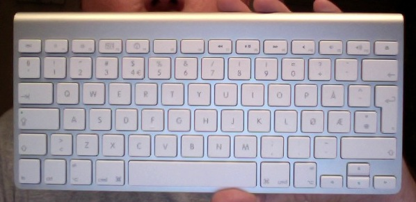

I was cleaning my MacBook Pro the other day and used a screen cleaning liquid and a cloth and figured I'd do the keyboad with the same treatment. Turned out however that I used a little bit too much fluid, some of the keys stopped working. I got somewhat sad and stressed out over it, I really love this keyboard. So I pulled out my electronics spray and figured it was a good cleaning tool for cleaning just about anything inside the keyboard, and the best part would be that it would vaporize completely. After my full treatment and having it dry for a couple of hours, the keyboard was completely dead. I was getting even more stressed. The keyboard was safely placed in a very dry room, with the hope that a couple of days would clear everything up and give me back my keyboard. No such luck.

My next plan; rip out all the keys and see if I could figure out how to totally take the keyboard apart - there simply aren't any screws on the back. After some 10-15 keys I couldn't really see a happy ending, so I decided to put them all back. 

At this point I was close to ordering a new one, and decided I had nothing to lose and put the keyboard in the dishwasher, no soap, 50 degrees centigrate. Ran for an hour and a half. Put it up for dry.

Day 1 after the dishwasher, no life.  
Day 2, lights worked.  
Day 3, bluetooth came alive.  
Day 4, some keys started working  
Day 5, fully functional keyboard (I'm typing this post on it.. ) - me, very very happy. Saved me some 600 Norwegian Kroners ($95 or so). 

For those who aren't familiar with the beauty I went through all this work for:

It was a crazy and interesting ride - and well worth it. :)
