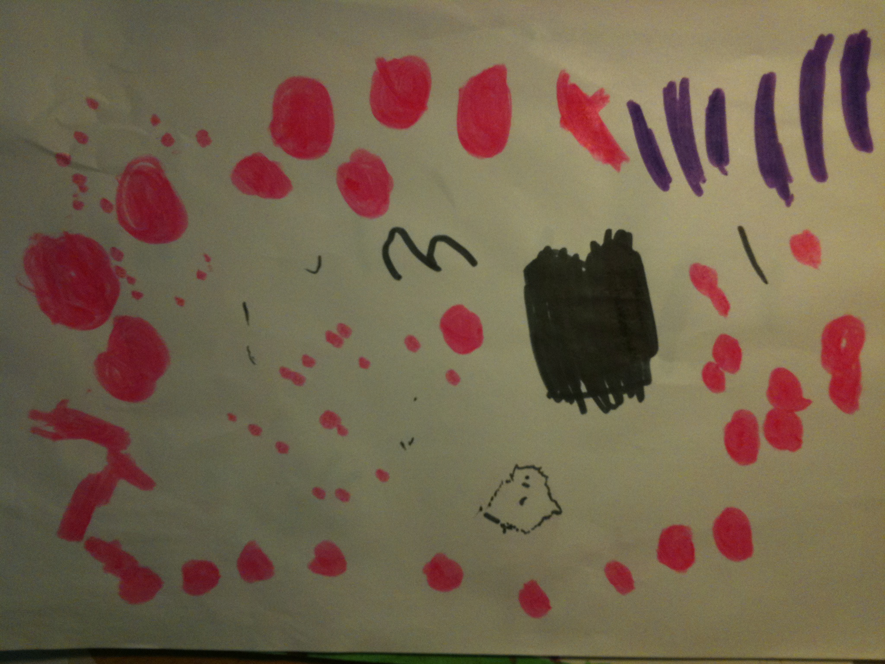

My 4 year old daughter loves to do creative things like drawing, clay-modelling and what not. Often she comes to me with something she has made for me to have, which I love and make me all warm. 

Most of the time I can actually see what she has made, usually drawings of people and all she need to tell me is who she has drawn. The other day she came with a drawing to me that was a bit too abstract for me (and I am a developer who loves abstract code).

 

My response was, like any parent, it was nice. And I paused for second and just needed to ask what it was a drawing of, searching for the hidden meaning. My daughter responded: Dad, they are just circles and lines and a big black box.  

My conclusion is, I need to start thinking simpler about things. :)
