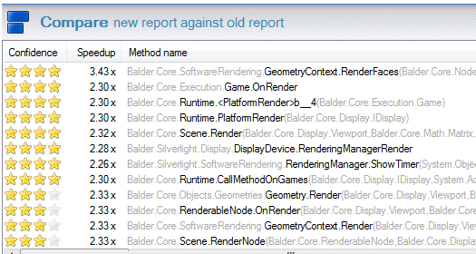

After just 4 hours of dedicated optimizations with the aid of the [EQATEC profiler](http://www.eqatec.com/tools/profiler/download) for Silverlight - I managed to speed up the rendering pipeline of Balder quite dramatically. The profiler has a great comparison feature - simple and straight to the point. It shows that the rendering pipeline for [Balder](http://balder.codeplex.com) got optimized at an average og 2.28 times. (RenderingManagerRender) :

