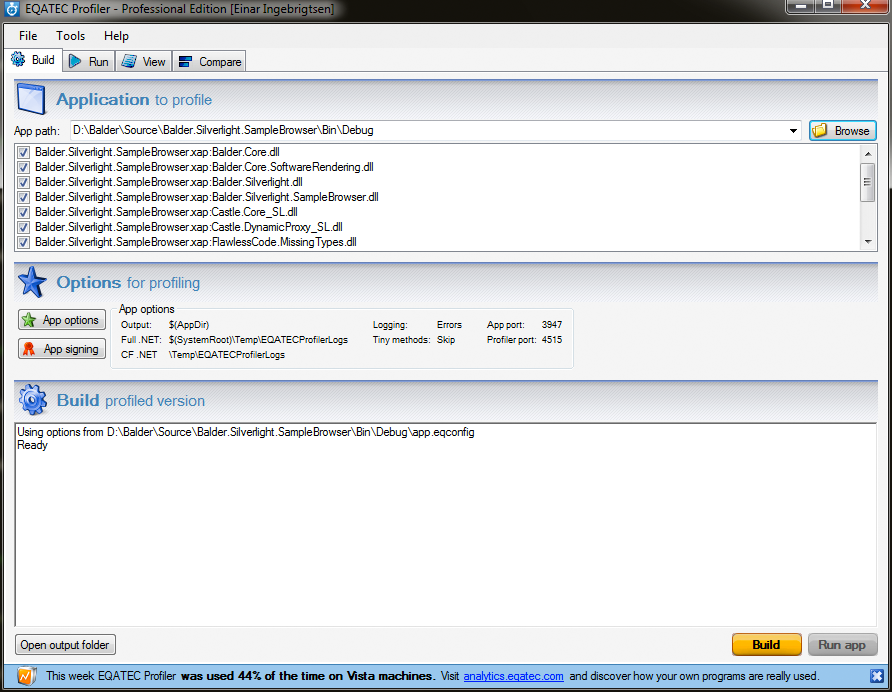
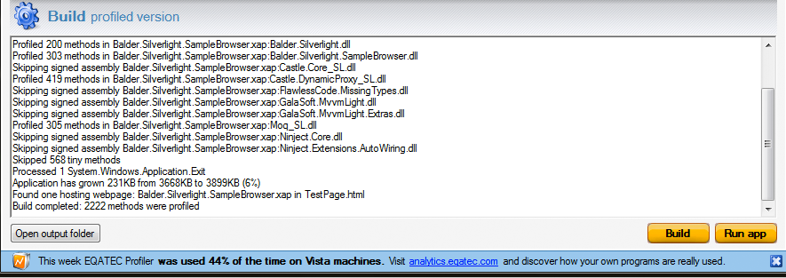
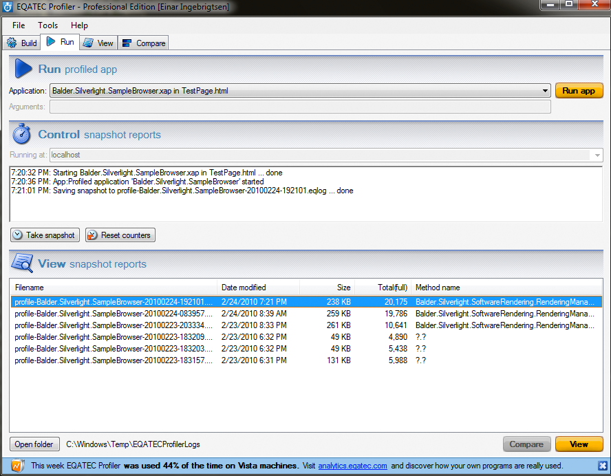
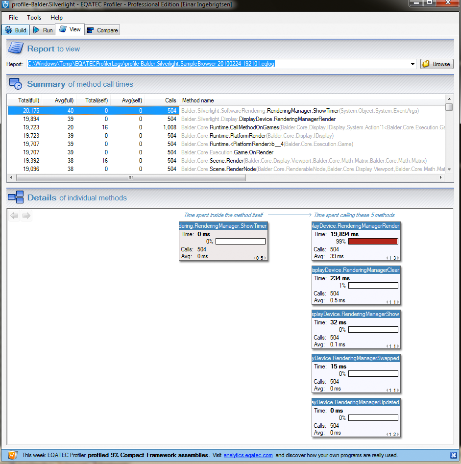
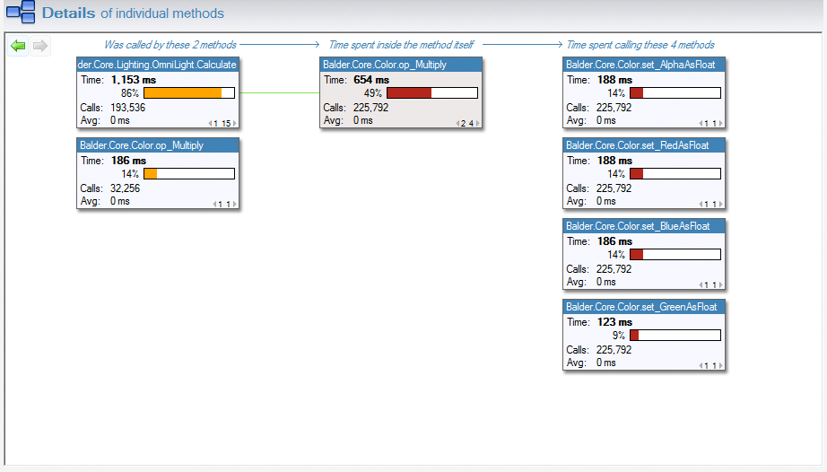

Its been a little more than 24 hours since I started playing with the [EQATEC](http://www.eqatec.com) profiler and have identified bottlenecks in [Balder](http://balder.codeplex.com) that is close to impossible to discover without a profiler. One of things I really liked about the EQATEC profiler was its really easy to use user interface, its super-intuitive and I got up and running in seconds and could drill down straight to the bottlenecks just as fast. What impresses me with the profiler is the speed of it, I've worked with quite a few profilers in the past for the desktop - and they have always surprised me in a negative way with the amount of memory they use and not to mention the enourmous datafiles they generate. EQATECs just feels right, kudos to Richard Flamsholt and his team in Denmark for this product. You can download a free/personal license from [here](http://www.eqatec.com/tools/profiler/download).

I thought I just give a quick guide into how its used.

The profiler is not integrated in Visual Studio and does not need to instrument your assemblies during compiletime, it works on the binary output of your compiled output. After starting the profiler, you need to point the profiler to your output directory in which the binaries for your application resides, typically the bindebug directory in your Visual Studio project folder. Click the browse button as shown below:

The first time you run it and if you have 3rd party assemblies that are signed you'll be asked to include or exclude these - the default recommendation is to exclude these. There is a resigning option included as well, but I didn't need this so I just skipped them. After it completes gathering your assemblies and recognizes the Silverlight app by finding the testpage and everything, you can go ahead and click the Build button in the lower right corner. It will instrument your binaries and add hooks for all your methods.

Then you just simply click the "Run App" button and your application will start and performance samples will be collected. You now need to play around in your application for the profiler to get enough data to play with.

After stopping your application, you'll be presented with the sample output with details of when it was profiled, its size and total time it ran.

Double click the session you want to view (if you have more than one) and you can start to drill into method calls with the summary sitting on top and a more visualized version of the method with drilldown capabilities at the bottom.

 

 Simple drill down and you'll see the amount of time spent in every method you drill down into:

And further: 

 

This is by far, in my oppinion, the best tool that has been released since Silverlight was released. It completes the developer experience and finally we can really show the full potential of Silverlight and the power the CLR actually gives us.

Thanks again to [EQATEC](http://www.eqatec.com) for the donation to Balder - we will certainly make use of the license and optimize as close as we can to clock-cycles. :)
