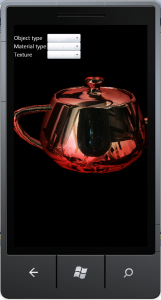

 After a couple of days of work - actually more like a couple of hours over a couple of days (sneaking away during vacation to feed my computer abstinence), I've managed to port [Balder](http://balder.codeplex.com) to Windows Phone 7, a couple of quirks needed to be fixed - like this [one](/post/2010/07/15/Dynamically-discovering-assemblies-and-types-on-Windows-Phone-7.aspx).

For now it uses the same software rendering engine as the Silverlight one. Needless to say, its not exactly the most optimal solution, but at least it proves that most of the code runs across both Silverlight and Windows Phone 7 without doing much to it.

The next goal is now to implement a fully hardware accelerated version of Balder for Windows Phone 7, using Xna.

Wish me luck. :)
