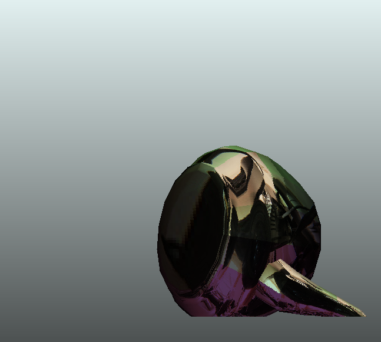

After quite a hectic 2010, a lot of work at my daytime job at Bouvet, taking on freelance work with projects utilizing Balder and maintaining Balder itself - I finally managed to get a new binary release out the door. Feels like a ton has been lifted off my shoulders.

You might be asking yourself, when is the next release - christmas time? What will it contain? Lets start with the first one, when. I can't exactly promise an exact time for that. But what I've been working on lately is a build server that will aid me in getting binaries out the door faster.

 I've put together a dual core Atom based machine (to the left), that will be my continuous integration and nightly build server. Its running [Hudson](http://hudson-ci.org/ "Hudson Continuous Integration Server"), a Java based continuous integration server software together with a [NAnt](http://nant.sourceforge.net/ "NAnt") build script. The purpose of it is to build continuously to get stuff out the door, but also assure that I'm not breaking anything while I'm developing new stuff. This means that I will commit myself to be a lot better at writing unit tests. Balder has a somewhat 20% test-coverage to date, and the last month I've broken a few of those tests, mostly due to architectural decisions that has rendered the tests unusable. So one of the things I will be working quite a lot on, is getting the existing tests up and running again, and also getting the coverage up to a decent level (80% +). Some parts of the engine is plain simple not testable, nor should it be testable. Such as drawing pixels on the screen, just doesn't make sense to try even to test it. Making that code testable would make performance drop a lot, plus its pretty much impossible to do it.

The build will be dropping new binaries to my DropBox account, and I'm working on a simple Build Viewer in Silverlight that one will be able to use to pick up new stuff from there.

There is a few other reasons I want to have this system in place. If one takes a look at the [Balder site](http://balder.codeplex.com) up on Codeplex, you'll notice a promise of not only Silverlight as the supported platform. Balder has since day one been written in a manner that would allow for more platforms, I just haven't gotten around to actually implement anyone else. I had a Windows Forms version once, but dropped it. Now, on the other hand, I've been preparing to scale out to the following platforms :

- Windows Phone 7 Series
- iPhone
- iPad
- Xna - targetting Windows + XBox (Windows Phone 7, partially)

Also, there are quite a few elements in the Core library that needs tender, love and care. As for the Silverlight specifics, I really want to see the following in there soon :

- Shaded textures (Flat + Gouraud)
- Multitexturing
- Bumpmapping
- Managed "pixel/vertex-shaders"
- Blend - Design time support

I haven't decided were to start off yet, but I will be monitoring the ["Issue Tracker"](http://balder.codeplex.com/workitem/list/basic) up on Codeplex and working actively with that to be my guide, so please cast your votes.

I've started the work on the shaded texturemapping, and it looks kinda cool (see the color difference at the bottom) :

 Also worth mentioning, I'll be focusing my energy also on getting documentation up to a decent level - I've included a lot of Xml documentation tags in the code, but have also started work on layout out samples in the help file. In order for people to start learning Balder, I'm also planning a few tutorials and some video tutorials as well.

One could say that I will not get bored with the above tasklist, I have enough to do - better start working. :)
