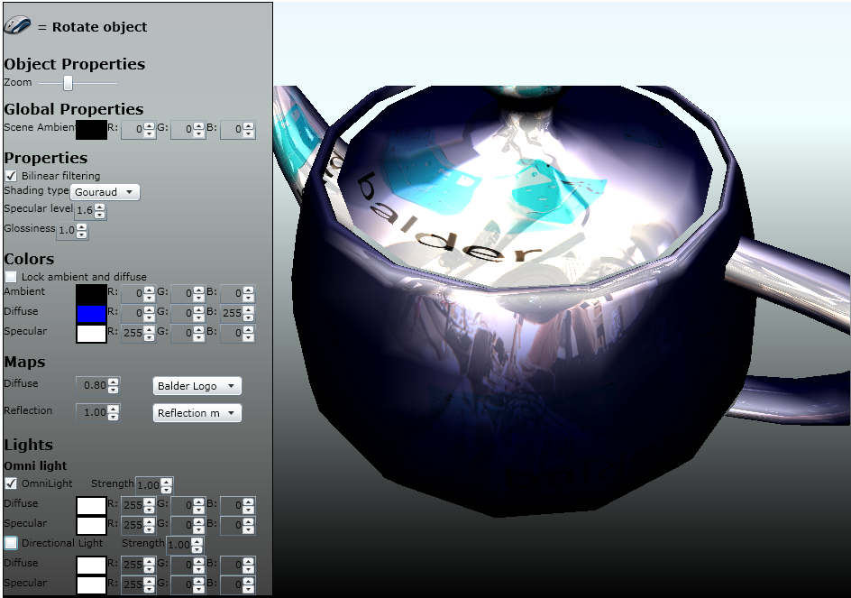

Its been a hectic week - but finally most of the pieces are falling into place for the next release. There is only a couple of minor features I want to add before calling it a release. Meanwhile, I've updated the [samplebrowser](/Balder/SampleBrowser/TestPage.html) and released it as a sneak peak. I've replaced the Material Picker sample with a Material Editor were you can actually edit all the properties of the materials and also the lights added to the scene.

Here's a screenshot of how it can look like when configured with all features enabled:

 If you're having trouble with the SampleBrowser on Safari or Chrome on the Mac, this is something I'm investigating. I've tested it with all browsers on Windows and Mac, but these two had some issues when textures were involved on my machine. Will look into it more carefully before releasing the next version. The odd thing though, it worked with the samplebrowser compiled as debug.
