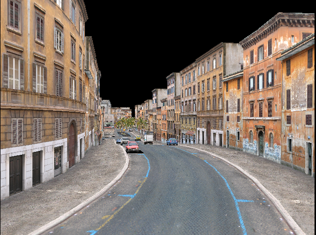
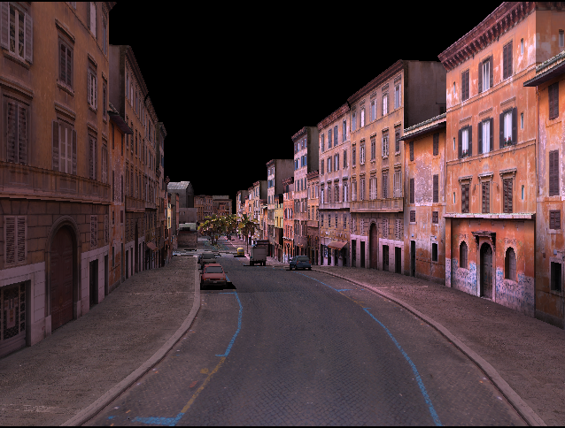

I've been working lately on a demo that is for gaming a lot more realistic than the spinning teapot or box that one sees in the sample browser for Balder. A friend of mine [Peter Rosenlund](https://sites.google.com/site/oletata/peterrosenlund2), an excellent graphics artist, gave me a 3D model of a city that I can use for that (thanks a lot!!).

In the 3D model, he had applied static lighting manually in 3DSMAX by painting the Vertex colors - a feature I had not implemented in Balder. After a few hours yesterday and this morning, I got it all up and running and I must say it looks kinda nice.

Balder, rendering city without vertex colors applied:

Balder, rendering same city with the vertex colors applied:

