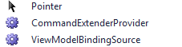
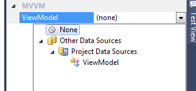
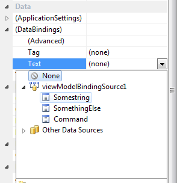
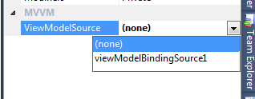
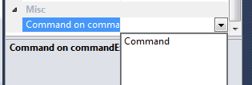

Not everyone has the luxury of jumping on new technologies, it can be historical reasons, don't have time to learn, deployment reasons - or flat out you simply don't like anything new :) .

Anyways, I was doing a codereview on a project last week, which was written in Windows Forms. The developers had some pain, Windows Forms being one of them - and a constant feeling that they were barking up the wrong tree when using Windows Forms. Its been a couple of years since my last Windows Forms project, and I must admit I remember the feeling of constantly banging my head against the wall without getting the code quality I wanted when doing UI.

One of the things I saw that the project could benefit from, was unit testing - to help them fight problems with regression, and get a constant quality indicator on the project. Having done a lot of WPF and Silverlight over the years and leaving Windows Forms behind, it just felt bad not having a proper UI pattern and I'm loving MVVM and the way it works - the simplicity of it. So I decided to do a spike, how could one implement MVVM in Windows Forms and get all the niceness of testability and full separation.

Keep in mind, I haven't done a full implementation of a framework or anything, just the basics to get started. The one thing I wanted was to be able for the view (Form or UserControl) to be able to observe changes from a ViewModel. Windows Forms does in fact recognize the interfaces we are so familiar with from WPF and Silverlight (INotifyPropertyChanged and INotifyCollectionChanged), so it was just a matter of figuring out how to get the ViewModel easily accessible in the designer in Windows Forms. I came up with something called ViewModelBindingSource. A very simple component that can be dragged onto the designer surface:

\[code language="csharp"\] public class ViewModelBindingSource : BindingSource { public ViewModelBindingSource(IContainer container) : base(container) { }

private object \_viewModel; private Type \_viewModelType;

\[Category("MVVM"), DefaultValue((string)null), AttributeProvider(typeof(IListSource))\] public Type ViewModel { get { return \_viewModelType; } set { SuspendBinding(); \_viewModelType = value; \_viewModel = Activator.CreateInstance(\_viewModelType); Add(\_viewModel); MoveFirst(); ResumeBinding(); } }

public override object this\[int index\] { get { return \_viewModel; } set { base\[index\] = value; } } } \[/code\]

The next thing I wanted to accomplish, was the ability to hook up Commands for Buttons and such, supporting the ICommand interface found in WPF. I came up with a CommandExtenderProvider:

\[code language="csharp"\] \[ProvideProperty("Command", typeof(Button))\] public class CommandExtenderProvider : Component, IExtenderProvider { private readonly Dictionary \_buttonsWithCommands; private readonly List \_uninitializedButtons; public CommandExtenderProvider() { \_buttonsWithCommands = new Dictionary(); \_uninitializedButtons = new List(); } public bool CanExtend(object extendee) { return extendee is Button; } private BindingSource \_viewModelSource; \[Category("MVVM")\] public BindingSource ViewModelSource { get { return \_viewModelSource; } set { \_viewModelSource = value; InitializeUninitializedButtons(); } } private void InitializeUninitializedButtons() { foreach( var button in \_uninitializedButtons ) { var commandName = \_buttonsWithCommands\[button\]; SetCommand(button, commandName); } \_uninitializedButtons.Clear(); } \[Editor(typeof(CommandEditor), typeof(UITypeEditor))\] public string GetCommand(Button button) { if (!\_buttonsWithCommands.ContainsKey(button)) { return null; } var command = \_buttonsWithCommands\[button\]; return command; } public void SetCommand(Button button, string commandName) { \_buttonsWithCommands\[button\] = commandName; if (null == ViewModelSource || null == ViewModelSource.Current) { \_uninitializedButtons.Add(button); return; } var property = ViewModelSource.Current.GetType().GetProperty(commandName); if (null != property) { var command = property.GetValue(ViewModelSource.Current, null) as ICommand; if (null != command) { button.Enabled = command.CanExecute(null); command.CanExecuteChanged += (s, e) => button.Enabled = command.CanExecute(null); button.Click += (s, e) => { if (command.CanExecute(null)) { command.Execute(null); } }; } } } } \[/code\]

In the designer, you'll get two new components you can then drag onto your Windows Forms design surface:

Simply start by dragging in the ViewModelBindingSource and look in the Properties of it. Under the MVVM category, you'll find the property ViewModel - a dropdown were you can select the ViewModel.

If you then drag onto the design surface a TextBox that you want to have databound to a property in the ViewModel and look in the Properties window for the TextBox. There you'll find your ViewModelBindingSource, expanding it will show all the properties available in the ViewModel:

For commands, we need the CommandExtenderProvider. That too can be dragged onto the surface. It has a property for selecting the ViewModelBindingSource:

Now you can add a button to the surface and go to properties, you'll find a property called Command. There you can select the command you want to be executed during Click.

There is still a bunch of things to be desired in order for this to fully support all aspects of MVVM. But it proves its possible to think in this way, even though your technology is not necessarily state of the art.

Hope anyone finds this interesting.

The source code can be found [here](http://dl.dropbox.com/u/5342359/Ingebrigtsen/WindowsForms_MVVM.zip).
