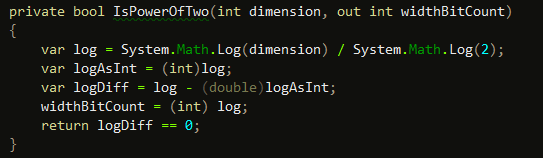

Yesterday I released a new version of the [Sample Browser for Balder](/Balder/SampleBrowser/TestPage.html) - but some of the samples just didn't work on Safari or Chrome on OSX, but worked in FireFox and Opera and all browsers on Windows (including Safari and Chrome).

Turns out there is an accuracy issue with using the System.Math.Log() method. It produces different results on OSX in Safari and Chrome when the code is compiled in release mode. When compiled in debug, it produces the correct result.

The method in Balder in question:

 By casting the Log() result to float you get past the problem.
